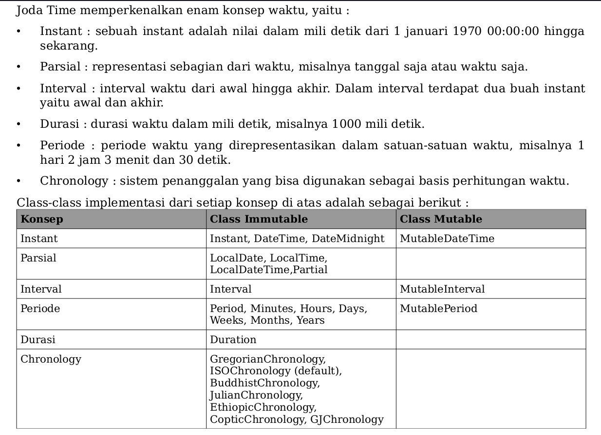

Joda Time adalah library pengolahan tanggal yang ditulis oleh Stephen Colebourne karena sudah
cukup frustasi dengan library pengolahan tanggal di dalam JDK yang cukup merepotkan untuk
perhitungan tanggal yang rumit. API untuk pengolahan tanggal bisa dibilang sebagai API yang
paling buruk dalam JDK saat ini. API tanggal mulai ada semenjak JDK versi 1.0, James Gosling
mencontek implementasi tanggal dari C, dimana implementasinya masih sederhana dan memiliki
banyak kelemahan secara design. Misalnya bulan di dalam class Date dimulai dari 0 hingga 11,
jadi kalau kita panggil method getMonth dari class Date untuk bulan Desember maka nilainya
adalah 11, bukan 12. Joda Time dibuat untuk memperbaiki hal ini.

Selain itu Joda Time juga mengenalkan beberapa konsep baru, seperti periode, interval dan
implementasi daerah waktu (timezone) yang lebih baik. Feature chronology juga sangat
membantu kalau kita ingin bekerja dengan sistem penanggalan yang tidak umum digunakan,
seperti penanggalan islam, budha, julian dan sebagainya.

Joda Time bisa digunakan bersamaan dengan class Date dan Calendar dengan baik, kita bisa
melakukan konversi dari class-class Joda Time menjadi kedua class tersebut dengan mudah. Jadi
Joda Time digunakan sebagai library perhitungan tanggal yang bisa melakukan hal-hal rumit
dengan mudah, kemudian setelah selesai peroses perhitunganya kita bisa mendapatkan
hasilnya dalam bentuk class Date. Feature backward compatibility inilah salah satu daya tarik
dari Joda Time.

Sebelum kita mulai belajar tentang konsep dalam Joda Time, kita perlu mendownload library
Joda Time

Joda Time memperkenalkan enam konsep waktu, yaitu :
- Instant : sebuah instant adalah nilai dalam mili detik dari 1 januari 1970 00:00:00 hingga
sekarang. 
- Parsial : representasi sebagian dari waktu, misalnya tanggal saja atau waktu saja. 
- Interval : interval waktu dari awal hingga akhir. Dalam interval terdapat dua buah instant
yaitu awal dan akhir. 
- Durasi : durasi waktu dalam mili detik, misalnya 1000 mili detik. 
- Periode : periode waktu yang direpresentasikan dalam satuan-satuan waktu, misalnya 1
hari 2 jam 3 menit dan 30 detik. 
- Chronology : sistem penanggalan yang bisa digunakan sebagai basis perhitungan waktu.

Instant adalah konsep paling sederhana, konsep ini sama dengan class Date, yaitu representasi
jumlah mili detik dari tanggal 1 januari 1970 00:00:00 hingga sekarang. Joda Time mempunyai
beberapa class yang digunakan untuk merepresentasikan instant ini, dua class yang sering
digunakan adalah class Instant dan class DateTime. Class Instant berisi satu buah property
dalam mili detik