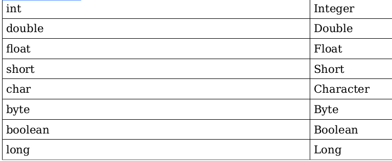

Feel of Java

Java pertama dibuat dan dikembangkan oleh Sun Microsystems untuk diimplementasikan dalam
embeded sistem seperti perangkat elektronik sehari-hari. Pada saat proses perancangan, java
didesain untuk menjadi “blue collar language” atau bahasa pemrograman untuk pekerjaan
sehari-hari, bukanya bahasa canggih untuk riset Phd. Untuk mencapai tujuan tersebut, dibuatlah
konsep “feel-of-java”, konsep ini berlandaskan kesederhanaan dan kemudahan dibaca.
Konsep ini memudahkan programmer dari berbagai macam background merasa mudah belajar
bahasa java. Sintaks java dibuat semirip mungkin dengan C dan C++, bahasa paling populer saat
itu. Bahkan beberapa konsep OOP dari C++ yang dirasa menyulitkan dihilangkan dari feature
java, misalnya operator overloading dan multiple inheritance.
Java juga mewarisi konsep static language dari C/C++. Static language mewajibkan setiap
variabel harus didefnisikan terlebih dahulu sebelum diinisialisasi. Konsep ini memudahkan
compiler untuk memeriksa statement java, sehingga error operasi variabel dapat ditemukan pada
saat compile. Berbeda dengan dynamic language seperti ruby dan PHP, semua variabel tidak
perlu didefnisikan dan kita bisa memasukkan tipe data apapun ke dalam variabel tersebut. Kalau
ada error dalam operasi variabel, error tersebut akan terdeteksi ketika program dijalankan.
Feature Kesederhanaan dan kemudahan dibaca mempunyai implikasi bahasa Java sangat verbose,
kode yang diketik relatif lebih banyak dari bahasa pemrograman lain. Hal inilah yang banyak
dikeluhkan programmer java, sehinga Sun memutuskan untuk membuat perubahan terhadap
bahasa java pada java versi 5. Perubahan tersebut antara lain:

- Enhanced for loop 
- Autoboxing/Unboxing 
- Static Import 
- Varargs 
- TypeSafe Enum 
- Generics 
- Annotation


Perubahan di atas semuanya dimaksudkan untuk mengurangi kode program yang harus ditulis
programmer tanpa mengurangi semangat kesederhanaan java. Mari kita bahas satu per satu dari
yang paling mudah.

Enhanced for Loop

For Loop Sebelum Java 5
Iterasi dalam sintaks bahasa java ada tiga bentuk: while, do-while dan for. Iterasi secara umum
digunakan untuk melakukan satu tugas tertentu secara berulang-ulang. Salah satu kegunaan dari
iterasi adalah mengambil satu-satu nilai dari sebuah kumpulan data.

Kumpulan data dalam java bisa dikategorikan tiga: array, Collection dan Map. 
Array adalah kumpulan data sejenis yang panjangnya tetap, setiap data diletakkan secara berurutan
berdasarkan index. Cara paling lazim untuk mengambil satu per-satu data dari array adalah
menggunakan suatu variabel index yang dimulai dari 0 kemudian diiterasi hingga n-1.

Collection dalam java mempunyai peran yang sangat penting dalam aplikasi, karena kita bisa
mempunyai kumpulan data dengan behaviour berbeda hanya dengan memilih class Collection
yang tepat, tidak perlu membuat algoritma sendiri hanya untuk melakukan sorting data.
Namun untuk mengambil data dari collection kita harus menulis kode yang sedikit lebih rumit
dibandingkan dengan array

Map adalah bentuk kumpulan data yang mempunyai pasangan key-value. Key dalam Map
berfungsi sebagai index yang mempunyai pasangan Value.

For Loop di Java 5

Bentuk penulisan for loop di atas cukup merepotkan dan dibandingkan dengan bahasa lain
sudah ketinggalan jaman. Oleh karena itu diperlukan perubahan sintaks penulisan for loop
agar proses pengambilan nilai dari kumpulan data menjadi lebih sederhana dan ringkas.
For loop untuk mengambil nilai dari array menjadi seperti berikut ini:
```java
String[] arr = {"a","b","c"};
    for(String current : arr) {
        System.out.println("current value" + current);
    }
```
Kode di atas menunjukkan bahwa kita tidak perlu lagi membuat variabel index untuk
mengambil satu per satu isi dari array. Setiap kali for dilaksanakan, maka elemen yang sedang
aktif akan disalin nilainya ke variabel current.

Bentuk for loop untuk Collection sama persis dengan Array di atas. Tidak lagi diperlukan
Iterator untuk mengambil satu per satu elemen dari collection


Autoboxing/Unboxing

Primitif dan Wrapper
Java dibuat pada pertengahan dekade 90-an, pada waktu itu memory RAM masih mahal. Arsitek
Java memutuskan untuk tetap memasukkan tipe data primitif dengan alasan menghemat memory.
Tipe data primitif hanya mempunyai nilai tunggal tanpa mempunyai method, sehingga
membutuhkan kapasitas memory yang lebih kecil dibanding dengan object.
Tipe data Primitif mempunyai class padananya yang disebut dengan Wrapper class yang
menyediakan method utility untuk melakukan convert dari satu tipe ke tipe yang lain, misalnya
mengkonvert data dari tipe int menjadi double. Berikut ini adalah tabel tipe data primitif dan
wrappernya:


