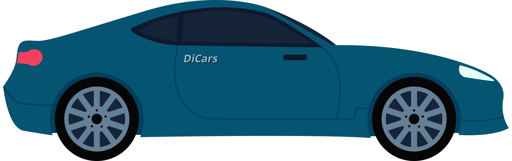
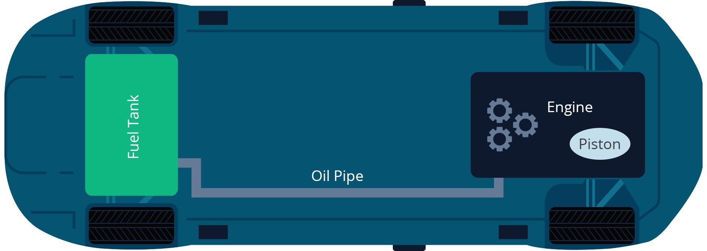
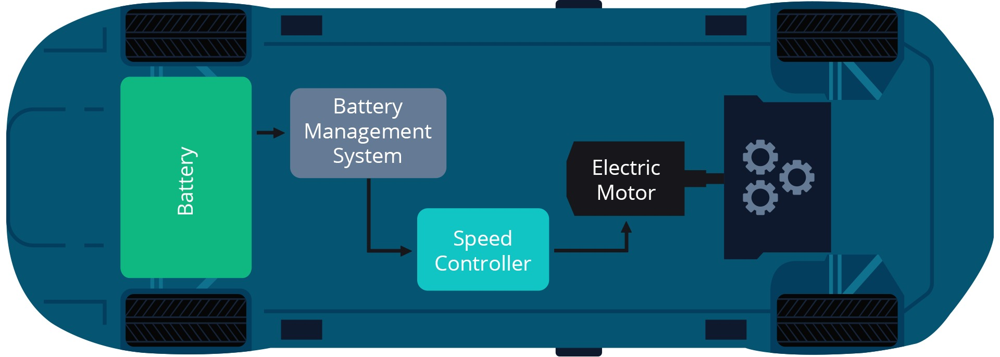
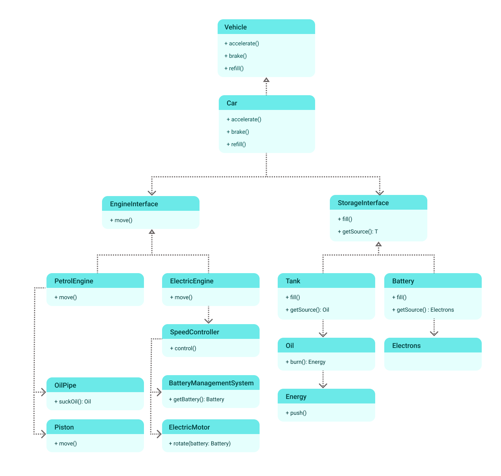

# Studi Kasus S.O.L.I.D

Pada studi kasus ini kita akan mencoba membuat pemodelan sebuah pabrik mobil skala besar atau Car Gigafactory. Sebuah
perusahaan mobil berskala internasional bernama DiCars Corp ingin membuat sebuah mobil tipe sedan dengan bentuk dan
model yang sama namun memiliki dua spesifikasi yang berbeda. Berikut ilustrasi bentuk mobil sedan tersebut:



Mobil Sedan tersebut nantinya akan memiliki dua tipe, yaitu tipe F dan tipe E. Di mana tipe F adalah tipe standar yang
menggunakan bahan bakar bensin konvensional. Sedangkan tipe E adalah tipe baru yang lebih ramah lingkungan menggunakan
daya listrik, atau disebut juga sebagai EV (Electric Vehicle). Perbedaan antara kedua tipe tersebut adalah terletak pada
spare part yang digunakan. Berikut adalah gambar diagram blok pada mobil sedan tipe F yang menggunakan bahan bakar
bensin konvensional:



Sedangkan untuk mobil sedan tipe E yang menggunakan daya listrik, berikut ini adalah gambar diagram bloknya:



Gambar di diatas hanya merupakan ilustrasi secara singkat untuk dapat membedakan beberapa spare part atau komponen dasar
antara mobil dengan bahan bakar bensin konvensional dengan mobil dengan daya listrik. Pada kenyataannya komponen di
dalamnya lebih kompleks.

Berdasarkan dua diagram blok di atas, terlihat bahwa pada mobil bahan bakar bensin konvensional menggunakan fuel tank
sebagai penyimpanan sumber bahan bakar (bensin) yang dihubungkan oleh oil pipe menuju mesin yang menggunakan piston
sebagai penggerak. Sedangkan pada mobil dengan daya listrik menggunakan battery sebagai penyimpanan sumber tenaga,
kemudian menggunakan komponen BMS (Battery Management System) untuk sistem pengisian daya atau pengaturan daya.
Selanjutnya dihubungkan oleh Speed Controller untuk pengaturan kecepatan pada motor listrik (Electric Motor).

Sebelum mobil tersebut diproduksi massal atau dibuat dalam bentuk prototype, perlu adanya simulasi terlebih dahulu. Di
sini peran kita adalah sebagai Vehicle Simulation Software Engineer, bertugas untuk membuat pemodelan kendaraan dalam
bentuk perangkat lunak. Agar dapat dilakukan uji coba terlebih dahulu sebelum diimplementasikan pada komponen yang
sesungguhnya, menghitung efisiensi yang dihasilkan dan membuat algoritma untuk dapat meminimalisir kesalahan.

Berikut ini adalah bentuk pemodelan dari mobil tersebut yang dibuat dalam bentuk diagram UML:



Kita mulai dengan pemodelan kelas Car seperti berikut:

```java
interface Vehicle<T> {
    void accelerate();

    void brake();

    void refill(T source);
}

class Car<T> implements Vehicle<T> {
    private final EngineInterface engine;
    private final StorageInterface<T> storage;

    public Car(EngineInterface engine, StorageInterface<T> storage) {
        this.engine = engine;
        this.storage = storage;
    }

    @Override
    public void accelerate() {
        engine.move();
    }

    @Override
    public void brake() {

    }

    @Override
    public void refill(T source) {
        storage.fill(source);
    }
}
```

Di dalamnya terdapat parameter EngineInterface, yaitu sebuah interface yang berfungsi agar dapat digunakan oleh dua
mesin yang berbeda. Selain itu juga terdapat parameter StorageInterface sebagai interface yang berfungsi agar dapat
digunakan oleh dua sumber daya yang berbeda. Penggunaannya adalah pada mesin bahan bakar bensin konvensional dan mesin
dengan sumber daya listrik.

```java
interface EngineInterface {
    void move();
}

interface StorageInterface<T> {
    void fill(T source);

    T getSource();
}
```

Agar dapat memahami apa saja komponen di dalam mesin bahan bakar bensin, perhatikan contoh pemodelan ini yang dibuat
dalam bentuk class PetrolEngine:

```java
class PetrolEngine implements EngineInterface {

    private final OilPipe oilPipe;
    private final Piston piston;

    public PetrolEngine(OilPipe oilPipe, Piston piston) {
        this.oilPipe = oilPipe;
        this.piston = piston;
    }

    @Override
    public void move() {
        Oil oil = oilPipe.suckOil();
        Energy energy = oil.burn();
        energy.push(piston);
    }
}

class Piston {
    void move() {

    }
}

class OilPipe {
    Oil suckOil() {
        return new Oil();
    }
}

class Oil {
    Energy burn() {
        //Do some combustion process here
        return new Energy();
    }
}

class Energy {
    public Energy() {
    }

    void push(Piston piston) {
        piston.move();
    }
}

class Tank implements StorageInterface<Oil> {

    private Oil oil;

    @Override
    public void fill(Oil source) {
        this.oil = source;
    }

    @Override
    public Oil getSource() {
        return oil;
    }
}
```

Dalam class PetrolEngine untuk mesin mobil bahan bakar bensin konvensional, class PetrolEngine ini implements
EngineInterface agar dapat digunakan pada parameter class Car. Terdapat pula class Tank yang implements
StorageInterface, class ini berfungsi sebagai penyimpanan bensin, di mana dimodelkan sebagai class Oil. Kemudian
terdapat class OilPipe yang memiliki method suckOil(), berfungsi sebagai pipa penghubung untuk menyedot bensin dari
tank.

Selanjutnya bensin tersebut melalui proses pembakaran (combustion) untuk menghasilkan energy yang dimodelkan pada class
Energy. Langkah terakhir adalah energy tersebut digunakan untuk menggerakkan piston agar mobil dapat bergerak. Sehingga
kira-kira penerapan class-nya menjadi seperti ini:

```java
//Petrol car
StorageInterface tank=new Tank();
        OilPipe oilPipe=new OilPipe();
        Piston piston=new Piston();
        EngineInterface petrolEngine=new PetrolEngine(oilPipe,piston);
        Car<Oil> petrolCar=new Car<Oil>(petrolEngine,tank);
        Oil oil=new Oil();
        petrolCar.refill(oil);
        petrolCar.accelerate();
        petrolCar.brake();
```

Sekarang mari perhatikan kembali bagaimana pemodelan dari mesin sumber daya listrik, yang dibuat dalam bentuk class
ElectricEngine. Class ElectricEngine ini implement EngineInterface agar dapat digunakan sebagai parameter pada class
Car. Di dalamnya terdapat komponen yang berbeda dari mesin bahan bakar bensin konvensional. Berikut adalah class
ElectricEngine yang berisi komponen pendukung di dalamnya:

```java
class ElectricEngine implements EngineInterface {

    private final SpeedController speedController;

    public ElectricEngine(SpeedController speedController) {
        this.speedController = speedController;
    }

    @Override
    public void move() {
        speedController.control();
    }
}

class SpeedController {

    private final BatteryManagementSystem bms;
    private final ElectricMotor motor;

    public SpeedController(BatteryManagementSystem bms, ElectricMotor motor) {
        this.bms = bms;
        this.motor = motor;
    }

    void control() {
        Battery battery = bms.getBattery();
        motor.rotate(battery);
    }
}

class BatteryManagementSystem {
    Battery getBattery() {
        return new Battery(new Electrons());
    }
}

class ElectricMotor {
    void rotate(Battery battery) {
        //Rotate the rotor using electric power from battery
    }
}

class Electrons {
}

class Battery implements StorageInterface<Electrons> {

    private final Electrons electrons;

    public Battery(Electrons electrons) {
        this.electrons = electrons;
    }

    @Override
    public void fill(Electrons source) {

    }

    @Override
    public Electrons getSource() {
        return electrons;
    }
}
```

Pada class ElectricEngine, terdapat class SpeedController yang digunakan sebagai pengatur kecepatan. Di dalamnya
terdapat class BatteryManagementSystem yang digunakan untuk sistem pengisian daya atau pengaturan daya dan class
ElectricMotor sebagai tenaga penggerak mobil, motor listrik ini membutuhkan daya listrik dari baterai. Sumber tenaga
disimpan pada baterai yang dimodelkan pada class Battery implements StorageInterface. Di dalam Battery terdapat class
Electrons, yang diibaratkan sebagai listrik yang tersimpan pada baterai. Sehingga, kira-kira penerapan class-nya menjadi
seperti ini:

```java
//Electric car
Electrons electrons=new Electrons();
        StorageInterface battery=new Battery(electrons);
        SpeedController speedController=new SpeedController(new BatteryManagementSystem(),new ElectricMotor());
        EngineInterface electricEngine=new ElectricEngine(speedController);
        Car<Electrons> electricCar=new Car<Electrons>(electricEngine,battery);
        electricCar.refill(electrons);
        electricCar.accelerate();
        electricCar.brake();
```

Berdasarkan ilustrasi dari studi kasus di atas, pada penerapan mobil dengan dua mesin yang berbeda, yaitu pada mobil
dengan bahan bakar bensin konvensional dan mobil dengan sumber daya listrik, dapat dibuat dengan satu class Car yang
sama. Di mana di dalamnya terdapat dua interface sebagai parameter, jadi sebenarnya kita dapat membuat class Car
tersebut dengan mesin/engine apa saja asalkan memenuhi syarat dengan implements interface EngineInterface dan
StorageInterface. Di sinilah salah satu peran prinsip SOLID.

Dengan menerapkan prinsip OCP dan DIP, kita tidak perlu membuat class baru untuk masing-masing tipe mesin yang berbeda,
juga tidak perlu me-refactor class apabila terdapat perubahan tipe mesin baru. Selain itu, prinsip SRP juga digunakan
untuk memisahkan masing-masing tanggung jawab pada class PetrolEngine, sehingga seluruhnya tidak ditumpuk pada class
PetrolEngine. Pemisahan juga dilakukan pada interface yang berbeda dengan menerapkan prinsip ISP. Nah, kira-kira seperti
itulah penerapan prinsip SOLID pada studi kasus mobil dengan tipe mesin yang berbeda, meskipun pada kenyataannya sistem
pada mobil lebih kompleks, kita hanya menggunakan beberapa komponen saja untuk memudahkan kita membuat pemodelannya.


