# Tipe Data Number
- Integer Number (Bilangan Bulat)
- Floating Point Number (Bilangan pecahan)

# Integer Number
- 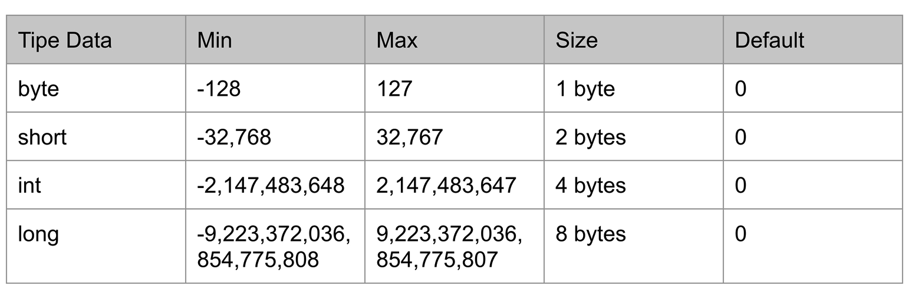

# Floating Point Number
- 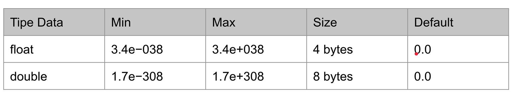

# Konversi Tipe Data Number
- Widening Casting (otomatis) byte -> short -> int -> long -> float -> double
- Narrowing Casting (manual) double -> float -> long -> int -> char -> short -> byte

# Tipe Data Character
- Data Character(huruf) di Java direpresentasikan oleh tipe char.
- Untuk membuat data char di Java, kita bisa menggunakan tanda ''(kurung buka kurung tutup petik satu)

# Tipe Data Boolean
- Tipe data boolean adalah tipe data yang memiliki 2 nilai, yaitu benar dan salah
- Tipe data boolean di Java direpresentasikan dengan kata kunci boolean
- Nilai benar direpresentasikan dengan kata kunci true
- Nilai salah direpresentasikan dengan kata kunci false
- Default value untuk boolean adalah false

# Tipe Data String

- Tipe Data String adalah tipe data yang berisikan kumpulan karakter atau sederhananya adalah text
- Di Java tipe data String direpresentasikan dengan kata kunci String
- Untuk membuat String di Java, kita menggunakan karakter "" (petik dua) sebelum dan sesudah text nya
- Default value untuk String adalah null

# Variable

- Variable adalah tempat untuk menyimpan data
- Java adalah bahasa static type, sehingga sebuah variable hanya bisa digunakan untuk menyimpan tipe data yang sama,
  tidak bisa berubah-ubah tipe data seperti dibahas pemrograman PHP atau JavaScript
- Untuk membuat variable di Java kita bisa menggunakan nama tipe data lalu diikuti dengan nama variable nya
- Nama variable tidak boleh mengandung whitespace(spasi, enter atau tab) dan tidak boleh seluruhnya number

# Kata kunci var
- Sejak Java 10, java mendukung pembuatan variable dengan kata kunci var, sehingga kita tidak perlu menyebutkan tipe datanya
- Namun perlu diingat, saat kita menggunakan kata kunci var untuk membuat variable, kita harus menginisiasi value / nilai dari variable tesebut secara langsung


# Kata Kunci Final

- Secara default variable di Java bisa diubah-ubah nilainya
- Jika kita ingin membuat sebuah variable yang datanya tidak boleh diubah setelah pertama kali dibuat, kita bisa
  menggunakan kata kunci final
- Isitilah variable seperti ini, banyak juga menyebutnya konstant

# Tipe Data Bukan Primitif (Tipe data Object)

- Tipe data primitif adalah tipe bawaan di dalam bahasa pemrograman. Tipe data primitif tidak bisa diubah lagi
- Tipe data number, char boolean adalah tipe data primitif. Tipe data primitif selalu memiliki default value
- Tipe data String buka tipe data primitif, tipe data bukan primitif tidak memiliki default value, dan bisa bernilai
  null
- Tipe data bukan primitif bisa memiliki method/function
- Di Java, semua tipe data primitif memiliki representasi tipe data bukan primitifnya

# Representasi Tipe Data Primitif
- 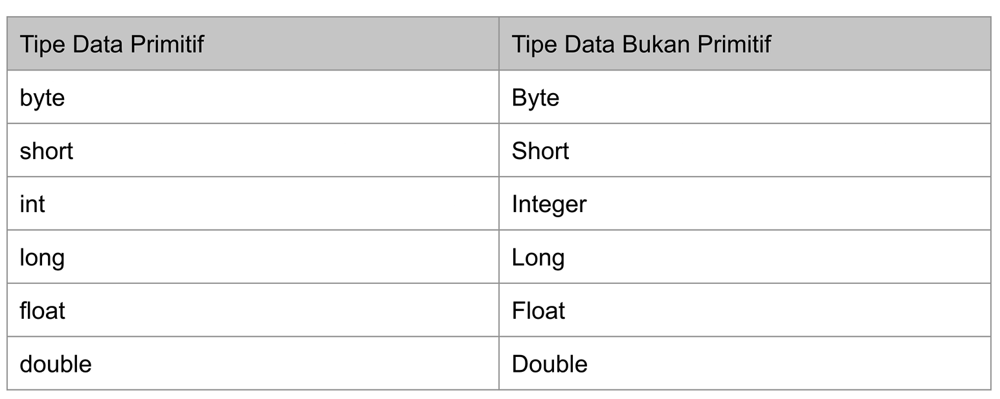
- 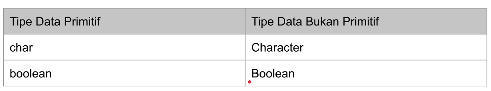

# Tipe Data Array

- Array adalah tipe data yang berisikan kumpulan data dengan tipe yang sama
- Jumlah data di Array tidak bisa berubah setelah pertama kali dibuat
- Cara kerja Array itu, ketika pertama kali kita membuat Array kita harus tentukan panjangnya Arraynya itu berapa. Misal
  10
- Saat kita membuat panjang Array 10, nanti si array itu akan menyiapkan kotak-kotak (Element) 10, dimana tiap kotak(
  Element) itu bisa kita masukan datanya, tapi ingat tipe datanya harus sama
- Untuk identitas tiap kotak itu dimulau dari angka 0 (indexnya) jadi misalnya panjang datanya 10, maka 0, 1, 2, 3, 4,
  5, 6, 7, 8, 9 (Panjang data - 1)
- Unutk mengakses atau mengubah data yang ada di element, kita bisa mengaksesnya dengan nomor indexnya. jadi jika kita
  ingin menubah data pertmama maka kita harus memasukan index 0, kalau ingin mengabil data yang terakhir harus memasukan
  index 9
- array[index], untuk mengambil data di Array
- array[index] = value, untuk mengubah data di Array
- array.length, untuk mengambil panjang Array
- Kalau di Java tidak ada istilah menghapus data array, karena kalau menghapus yang tadinya panjang array nya 10, jadi 9 itu engga bisa di Java
- yang ada kita mungkin memasukan data kosong ke dalam array nya
- Jadi di Java panjang Array sudah fix

# Array di dalam Array
- 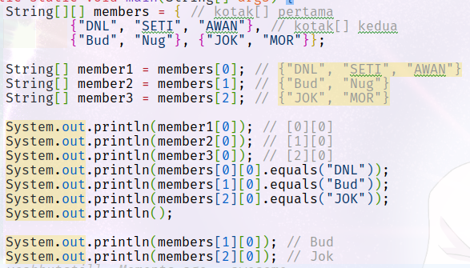

# Operasi Matematika
- 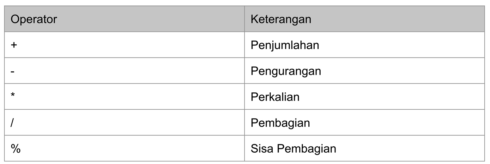

# Augmented Assignments
- 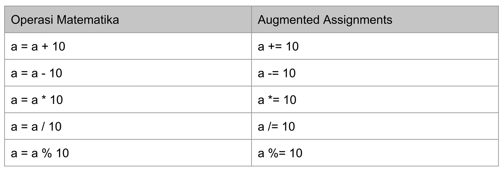

# Unary Operator
- 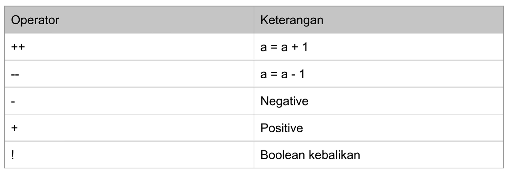

# Operasi Perbandingan

- Operasi perbandingan adalah operasi untuk membandingkan dua buah data
- Operasi perbandingan adalah operasi yang menghasilkan nilai boolean (benar atau salah)
- Jika hasil operasinya adalah benar, maka nilainya adalah true
- Jika hasil operasinya adalah salah, maka nilainya adalah false
- > lebih dari
- < kurang dari
- > = lebih dari sama dengan
- <= kurang dari sama dengan
- == sama dengan
- != tidak sama dengand
- Semua operasi ini bisa digunakan disemua tipe data number namun nanti balikan dari nilai resultnya adalah tipe boolean
  true/false

# Operasi Boolean

- Operasi ini sederhana, yang digunakan untuk membandingakn dua data boolean
- && dan
- || atau
- ! kebalikan
- 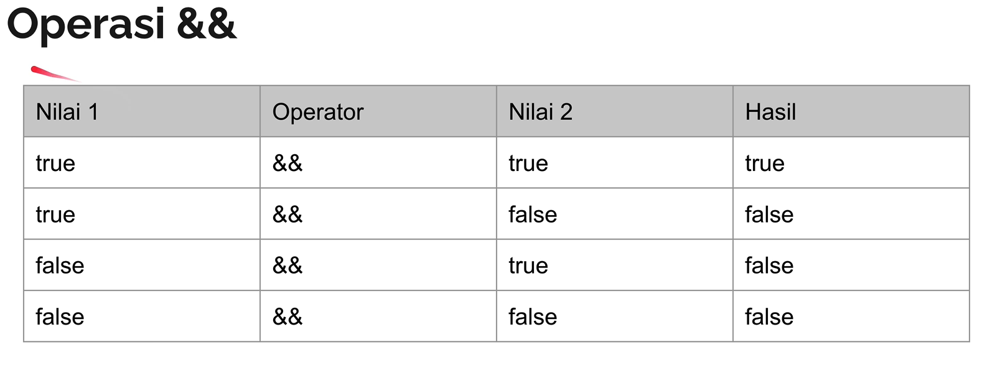
- 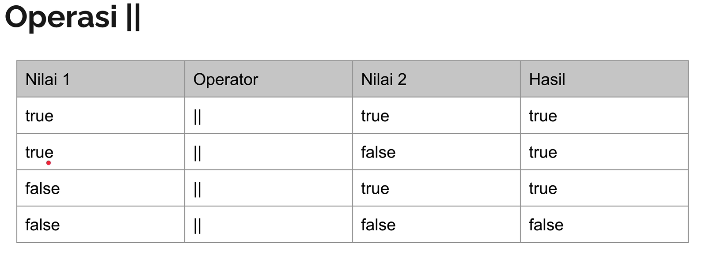
- 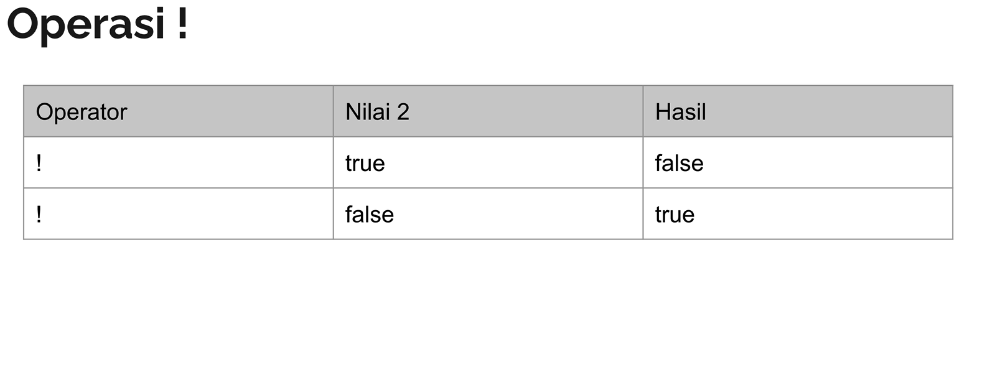

# Expression

- Expression adalah konstruksi dari variable, operator dan pemanggilan method yang mengevaluasi menjadi sebuah single
  value
- Expression adalah core component dari statement
- 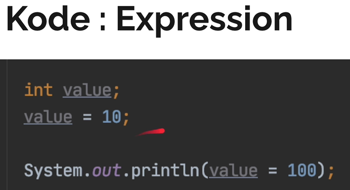

# Statement

- Statement adalah bisa dibilang kalimat lengkap dalam bahasa.
- Sebuah Statement berisikan execution komplit, biasanya diakhiri dengan titik koma
- Ada beberapa jenis statement
- Assigment expression, ini adalah statement yang mengubah value
- Penggunaan ++ dan --, ini adalah statement yang manbahkan nilainya ke diri sendiri
- Method invocation, ini adalah manggil method 
- Object creation expression, ini adalah pembuatan object baru
- Jadi kalau kumpulan expression adalah statement

# Block

- Block adalah kumpulan statement yang terdiri dari nol atau lebih statement
- Kalau kumpulan statement adalah block
- Block itu diawali dan diakhiri dengan kurung kurawal { }

# If Statement

- Dalam bahasa Java, if adalah salah satu kata kunci yang digunakan untuk percabangan
- Percabangan itu artinya kita bisa mengeksekusi kode program tertentu ketika suatu kondisi terpenuhi
- Hampir di semua bahasa pemrograman mendukung if expression
- didalam if terdapat parameter expression dari nilai boolean

# Else Statement

- Block if akan dieksekusi ketika kondisi if bernilai true
- Kadang kita ingin melakukan eksekusi program tertentu jika kondisi if bernilai false
- Hal ini bisa dilakukan menggunakan else expression

# Else if Statement

- Kadang dalam if, kita butuh membuat beberapa kondisi
- Kasus seperti ini, di Java kita bisa menggunakan Else if Expression
- Else if di Java bisa lebih dari satu

# Switch Statement

- Kadang kita hanya butuh menggunakan kondisi sederhana di if statement, seperti hanya menggunakan perbandingan ==
- Switch adalah statement percabangan yang sama dengan if, namum lebih sederhana cara pembuatannya
- Kondisi di switch statement hanya untuk perbandingan ==

# Switch Lambda

- Di Java versi 14, diperkenalkan switch expression dengan lambda
- ini lebih mempermudah saat penggunaan switch expression karena kita tidak perlu lagi menggunakan kata kunci break
- kalau teman-teman pengen tidak ada penggabungan antara nilai a dan nilai b, maka gunakan ini
- -> {} block seperti ini yang disebut lambda

# Kata kunci yield

- Di Java versi 14, ada kata kunci baru yaitu yield, dimana kita menggunakan kata kunci yield untuk mengembalikan nilai
  pada switch statement
- Ini sangat mempermudah kita ketika butuh membuat data berdasarkan kondisi switch statement

# Ternary Operator

- Ternary operator adalah operator sederhana dari if statement
- Ternary operator terdiri dari kondisi yang dievaluasi, jika menghasilkan true maka nilai pertama diambil, jika false
  maka nilai kedua diambil

# For Loop

- for adalah salah satu kata kunci yang biasa digunakan untuk melakukan perulangan
- Block kode yang terdapat didalam for akan selalau diulangi selama kondisi for terpenuhi
- sintak perulangan for
- ```java
  for(init statement; kondisi; post statement) {
    // block perulangan
  }
  ```
- init statement akan dieksekusi hanya sekali diawal sebelum perulangan
- kondisi akan dilakukan pengecekan dalam setiap perulangan, jika true perulangan akan dilakukan, jika false perulangan
  akan berhenti
- post statement akan dieksekusi setiap kali diakhiri perulangan
- init statement, kondisi dan post statement tidak wajib diisi, jika kondisi tidak diisi, berarti kondisi selalu
  bernilai true

# While Loop

- While loop adalah versi perulangan yang lebih sederhana dibanding for loop
- di While Loop, hanya terdapat kondisi perulangan, tanpa ada init statement dan post statement

# Do While Loop

- perulangan ini mirip dengan perulangan while
- Perbedaannya hanya pada pengecekan kondisi
- Pengecekan kondisi di while loop dilakukan di awal sebelum perulangan dilakukan, sedangkan di do while loop dilakukan
  setelah perulangan dilakukan
- Oleh karena itu dalam do while loop, minimal pasti sekali perulangan dilakukan walaupun kondisi tidak bernilai true

# Break & Continue

- Pada switch statement, kita sudah mengenal kata kunci break, yaitu untuk menghentikan case dalam switch
- Sama dengan pada perulangan, break juga digunakan untuk menghentikan seluruh perulangan.
- Namun berbeda dengan continue, continue digunakan untuk menghentikan perulangan saat ini, lalu melanjutkan ke
  perulangan selanjutnya

# For Each

- Kadang kita bisa mengakses data array menggunakan perulangan
- Mengakses data array menggunakan perulangan sangat bertele-tele, kita harus membuat counter, lalu mengakses array
  menggunakan counter yang kita buat
- Namun untungnya, di Java terdapat perulangan for each, yang bisa digunakan untuk mengakses seluruh data di Array
  secara otomatis

# Method

- Method adalah block kode program yang akan berjalan saat kita panggil
- Untuk membuat method di Java, kita bisa menggunakan kata kunci void, lalu diikuti dengan nama method, kurung () dan
  diakhiri dengan block
- Kita bisa memanggil method dengan menggunakan nama method lalau diikuti dengan kurung ()
- DI bahasa pemrograman lain, Method juga disebut dengan function

# Method Parameter

- Kita bisa mengirim informasi ke method yang ingin kita panggil
- Untuk melakukan hal tersebut, kita perlu menambahkan parameter atau argument di method yang sudah kita buat
- Cara membuat parameter sama seperti cara membuat variable
- Parameter ditempatkan didalam kurung () di deklarasikan method
- Parameter bisa lebih dari satu, jika lebih dari satu, harus dipisahkan menggunakan tanda koma
- Jadi kalau butuh argument yang dikirim dari luar methodnya saat dipanggil, kita bisa menggunakan method dengan
  parameter

# Method Return Value

- Secara default, method itu tidak menghasilkan value apapun, namun jika kita ingin menghasilkan retun value. Kita bisa
  memnbuat sebuah method yang mengembalikan nilai
- Agar method bisa menghasilkan value, kita harus mengubah kata kunci void dengan tipe data yang ingin dihasilkan
- Dan di dalam block method, untuk menghasilkan nilai tersebut, kita harus menggunakan kata kunci return, lalu diikuti
  dengan data yang sesuai dengan tipe data yang sudah kita deklarasikan di method
- Di Java, kita hanya bisa menghasilkan 1 data di sebuah method, tidak bisa lebih dari satu

# Method Variable Argument

- Kadang kala kita butuh mengirim data ke method dengan jumlah data yang tidak pasti
- Biasanya, agar bisa seperti ini, kita akan menggunakan Array sebagai parameter di method tersebut
- Namun di Java, kita bisa menggunakan variable argument, untuk mengirim data yang berisi jumlah datanya tidak tentu,
  bisa nol atau lebih
- Parameter dengan tipe variable argument, hanya bisa ditempatkan di posisi akhir parameter

# Method Overloading

- Method overloading adalah kemampuan membuat method dengan nama yang sama lebih dari sekali.
- Namun ada ketentuan yang harus diikuti, yaitu data parameter di method tersebut harus berbeda-beda, entah jumlah atau
  tipe data parameternya
- Jika ada yang sama, maka program Java kita akan error

# Recursive Method

- Recursive method adalah kemampuan method memanggil method dirinya sendiri
- Kadang memang ada banyak problem, yang lebih mudah diselesaikan menggunakan recursive method, seperti contohnya kasus
  factorial

# Problem Dengan Recursive

- Walaupun recursive method itu sangat menarik, namun kita perlu berhat-hati
- Jika recursive terlalu dalam, maka akan ada kemungkinan terjadi error StackOverflow, yaitu error dimana stack method
  terlalu banyak di Java
- kenapa problem ini bisa terjadi? Karena ketika kita memanggil method, Java akan menyiapkannya dalam stack, jika method
  tersebut memanggil method lain, maka stack akan menumpuk terus, dan jika terlalu dalam, maka stack akan terlalu besar
  dan biasanya menyebabkan error StackOverflow

# Scope

- Di Java, variable hanya bisa diakses di dalam area dimana mereka dibuat
- Hal ini disebut scope
- Contoh, jika sebuah varible dibuat di method, maka hanya bisa diakses di method tersebut atau jika dibuat didalam
  block, maka hanya bisa diakses didalam block tersebut

# Java OOPs Interview Questions and Answers

### Question 1: What is Object-Oriented Programming (OOP) and what are its core principles?

- Jawaban: Pemrograman Berorientasi Objek adalah paradigma pemrograman yang mengatur kode menjadi objek-objek yang
  saling berinteraksi. Prinsip inti OOP adalah:
- Encapsulation: Menggabungkan data dan metode bersama-sama dalam satu kelas untuk menyembunyikan detail internal dan
  menyediakan interface yang terkontrol.
- Inheritance: Mengizinkan kelas mewarisi properti dan perilaku dari kelas induk, memfasilitasi penggunaan kembali kode,
  dan menciptakan hubungan “is-a”.
- Polymorphism: Kemampuan objek untuk mengambil berbagai bentuk, memungkinkan kelas yang berbeda untuk
  mengimplementasikan metode yang sama dengan cara yang berbeda.
- Abstraction: Menyederhanakan sistem yang kompleks dengan merepresentasikan fitur-fitur penting dan menyembunyikan
  detail yang tidak perlu.

### Question 2: What is the difference between a class and an object in Java?

- Jawaban: Di Java, kelas adalah cetak biru atau templat yang mendefinisikan struktur, perilaku, dan properti objek. Ini
  berfungsi sebagai cetak biru untuk membuat instance objek. Sebuah objek, di sisi lain, adalah turunan dari sebuah
  kelas. Ini mewakili entitas tertentu yang memiliki status dan perilakunya sendiri berdasarkan kelas tempat instance
  tersebut dibuat.

### Question 3: What is the difference between composition and inheritance in Java?

- Jawaban: Komposisi dan pewarisan adalah dua cara untuk mencapai penggunaan kembali kode di Java. Komposisi adalah
  hubungan dimana suatu kelas berisi satu atau lebih instance dari kelas lain sebagai variabel anggota. Ini
  mempromosikan fleksibilitas dan desain yang digabungkan secara longgar. Warisan, di sisi lain, adalah hubungan “is-a”
  di mana suatu kelas memperoleh properti dan perilaku dari kelas induk. Ini mempromosikan penggunaan kembali kode
  tetapi dapat mengarah pada penggabungan yang lebih erat dan hierarki kelas yang lebih kaku.

### Question 4: Explain the concept of method overloading and method overriding.

- Jawaban: Kelebihan metode mengacu pada memiliki beberapa metode di kelas yang sama dengan nama yang sama tetapi
  parameternya berbeda. Kompiler membedakan metode-metode ini berdasarkan jumlah, jenis, dan urutan parameter. Kelebihan
  metode memungkinkan nama metode yang sama digunakan untuk perilaku yang berbeda.
- Penggantian metode terjadi ketika subkelas menyediakan implementasinya sendiri atas metode yang sudah ditentukan di
  kelas induknya. Metode dalam subkelas harus memiliki nama, tipe pengembalian, dan parameter yang sama (atau tipe
  pengembalian kovarian), dan harus ditandai dengan anotasi @Override. Penggantian metode memungkinkan perilaku
  polimorfik dan mengaktifkan pemanggilan metode yang paling sesuai berdasarkan jenis objek saat runtime.

### Question 5: What is the purpose of the final keyword in Java?

- Jawaban: Di Java, kata kunci final digunakan untuk membuat variabel, metode, atau kelas tidak dapat diubah atau
  diubah. Ketika diterapkan pada suatu variabel, ini mencegah nilainya diubah. Ketika diterapkan pada suatu metode, ini
  mencegah metode tersebut ditimpa di subkelas mana pun. Ketika diterapkan ke suatu kelas, ini mencegah kelas tersebut
  dijadikan subkelas.

### Question 6: What is the difference between an abstract class and an interface in Java?

- Jawaban: Di Java, kelas abstrak adalah kelas yang tidak dapat dipakai dan dimaksudkan untuk dijadikan subkelas. Itu
  bisa berisi metode abstrak dan non-abstrak, dan bisa memiliki variabel anggota. Kelas abstrak menyediakan interface
  umum dan perilaku bersama untuk subkelasnya.
- Di sisi lain, interface di Java adalah kumpulan metode abstrak yang menentukan kontrak untuk kelas yang
  mengimplementasikannya. Itu tidak boleh memiliki variabel anggota atau implementasi metode. interface memungkinkan
  kelas memiliki banyak warisan dengan mengimplementasikan banyak interface.
- Singkatnya, meskipun kelas abstrak menyediakan perilaku umum dan dapat memiliki variabel anggota, interface menentukan
  kontrak bagi kelas untuk diimplementasikan dan mengaktifkan pewarisan berganda.

### Question 7: What is method overloading and method overriding in Java?

- Jawaban: Kelebihan metode mengacu pada praktik memiliki beberapa metode di kelas yang sama dengan nama yang sama
  tetapi parameternya berbeda. Kompiler menentukan metode mana yang akan dipanggil berdasarkan jumlah, jenis, dan urutan
  parameter. Kelebihan metode memungkinkan metode dengan fungsi serupa tetapi parameter masukan berbeda dikelompokkan
  bersama di bawah nama yang sama.
- Sebaliknya, penggantian metode terjadi ketika subkelas menyediakan implementasinya sendiri atas metode yang telah
  ditentukan di kelas induknya. Metode dalam subkelas harus memiliki nama, tipe pengembalian, dan parameter yang sama (
  atau tipe pengembalian kovarian), dan harus ditandai dengan anotasi @Override. Penggantian metode memungkinkan
  perilaku polimorfik, di mana subkelas dapat memiliki implementasi sendiri atas metode yang ditentukan di kelas
  induknya.

### Question 8: What is the purpose of the super keyword in Java?

- Jawaban: Kata kunci super di Java digunakan untuk merujuk pada superclass (kelas induk) dari kelas saat ini. Hal ini
  sering digunakan untuk memanggil konstruktor atau metode superkelas, mengakses variabel superkelas, atau membedakan
  antara metode atau variabel superkelas dan subkelas dengan nama yang sama. Kata kunci super biasanya digunakan dalam
  skenario di mana subkelas ingin memperluas fungsionalitas kelas induknya sambil tetap memanfaatkan fitur kelas induk.

### Question 9: Explain the concept of encapsulation in Java.

- Jawaban: Enkapsulasi adalah salah satu prinsip dasar pemrograman berorientasi objek. Ini melibatkan penggabungan
  data (variabel) dan metode (fungsi) menjadi satu unit yang disebut kelas. Kelas menyediakan antarmuka terkontrol untuk
  berinteraksi dengan keadaan internalnya, menyembunyikan detail implementasi dari akses luar. Enkapsulasi melindungi
  integritas data dengan mencegah akses dan manipulasi langsung, memastikan bahwa data diakses dan dimodifikasi hanya
  melalui metode yang ditentukan. Hal ini membantu menjaga konsistensi data, merangkum logika kompleks, dan
  memfasilitasi pemeliharaan dan fleksibilitas kode.

### Question 10: What is the role of the this keyword in Java?

- Jawaban: Kata kunci this di Java adalah referensi ke instance objek saat ini dalam suatu kelas. Hal ini terutama
  digunakan untuk membedakan antara variabel instan dan parameter atau variabel lokal yang memiliki nama yang sama. Kata
  kunci this memungkinkan Anda mengakses dan memanipulasi anggota objek saat ini (variabel dan metode). Ini biasanya
  digunakan dalam konstruktor, metode instan, dan setter untuk merujuk pada keadaan dan perilaku objek saat ini.

### Question 11: What is the difference between a static method and an instance method in Java?

- Jawaban: Di Java, metode statis adalah milik kelas itu sendiri, bukan milik instance spesifik kelas tersebut. Itu bisa
  dipanggil langsung di kelas itu sendiri tanpa perlu membuat instance objek. Metode statis hanya dapat mengakses
  variabel statis dan metode statis lainnya. Di sisi lain, metode instan dikaitkan dengan turunan kelas dan dapat
  mengakses variabel instan dan variabel statis.

### Question 12: What is the purpose of the final keyword when used with classes and methods?

- Jawaban: Ketika kata kunci final digunakan dengan suatu kelas, itu berarti kelas tersebut tidak dapat
  disubklasifikasikan atau diperluas. Ini mencegah kelas lain untuk mewarisinya. Ketika final digunakan dengan suatu
  metode, itu berarti bahwa metode tersebut tidak dapat ditimpa oleh subkelas mana pun. Ini memastikan bahwa perilaku
  metode yang didefinisikan dalam superclass tetap tidak berubah.

### Question 13: What is the difference between shallow copying and deep copying?

- Jawaban: Penyalinan dangkal dan penyalinan dalam adalah konsep yang berkaitan dengan kloning objek. Penyalinan dangkal
  membuat objek baru dengan lokasi memori terpisah tetapi berbagi referensi objek internal dengan objek asli.
  Sebaliknya, penyalinan dalam membuat objek baru dengan lokasi memori terpisah dan juga membuat salinan baru dari objek
  internal, menyalin referensinya secara rekursif.

### Question 14: What are access modifiers in Java, and what are their different levels?

- Jawaban: Pengubah akses menentukan visibilitas dan aksesibilitas kelas, variabel, dan metode di Java. Ada empat
  pengubah akses:
- publik: Pengubah akses publik mengizinkan akses tidak terbatas ke kelas, variabel, atau metode dari kelas atau paket
  lain mana pun.
- protected: Pengubah akses yang dilindungi memungkinkan akses dalam paket yang sama atau berdasarkan subkelas bahkan
  dalam paket lain.
- privat: Pengubah akses privat membatasi akses ke kelas yang sama saja dan menyembunyikan anggota dari kelas lain.
- Default (tanpa pengubah): Ketika tidak ada pengubah akses yang ditentukan, pengubah akses default mengizinkan akses
  dalam paket yang sama tetapi tidak dari paket lain.

### Question 15: What is the role of the equals() and hashCode() methods in Java?

- Jawaban: Metode equal() digunakan untuk membandingkan persamaan dua objek. Biasanya ditimpa di kelas untuk menentukan
  perbandingan kesetaraan khusus berdasarkan atribut tertentu. Metode hashCode() mengembalikan nilai integer yang
  mewakili pengidentifikasi unik objek. Ini digunakan dalam struktur data berbasis hash seperti HashMap untuk menemukan
  dan membandingkan objek dengan cepat.

### Question 16: What is the difference between method overriding and method overloading in Java?

- Jawaban: Penggantian metode terjadi ketika subkelas menyediakan implementasinya sendiri atas metode yang sudah
  ditentukan dalam superkelasnya. Tanda tangan metode (nama, tipe kembalian, dan parameter) harus sama. Metode
  overriding digunakan untuk mencapai perilaku polimorfik.
- Sebaliknya, kelebihan metode mengacu pada memiliki beberapa metode di kelas yang sama dengan nama yang sama tetapi
  parameternya berbeda. Metode dapat memiliki jumlah parameter yang berbeda atau jenis parameter yang berbeda. Kelebihan
  metode digunakan untuk menyediakan berbagai cara untuk memanggil metode yang sama dengan kombinasi argumen yang
  berbeda.

### Question 17: What are abstract classes in Java, and when would you use them?

- Jawaban: Kelas abstrak di Java adalah kelas yang tidak dapat dipakai dan dimaksudkan untuk dijadikan subkelas. Ia
  dapat memiliki metode abstrak (metode tanpa implementasi) maupun metode konkrit. Kelas abstrak berfungsi sebagai cetak
  biru untuk subkelas dan dapat menentukan perilaku dan properti umum. Mereka digunakan ketika Anda ingin menyediakan
  antarmuka umum dan implementasi parsial ke sekelompok kelas terkait.

### Question 18: What is the difference between composition and aggregation in Java?

- Jawaban: Komposisi dan agregasi keduanya merupakan bentuk asosiasi antar kelas di Java.
- Komposisi mewakili hubungan “keseluruhan-bagian” yang kuat, di mana masa hidup objek yang terkandung bergantung pada
  masa hidup objek kontainer. Objek kontainer memiliki dan mengelola siklus hidup objek yang ada di dalamnya.
- Agregasi, di sisi lain, mewakili hubungan “keseluruhan-bagian” yang lemah, di mana objek-objek yang terkandung dapat
  ada secara independen dari objek kontainer. Objek container menyimpan referensi ke objek yang ada di dalamnya, namun
  objek tersebut bisa berada di luar cakupan container.

### Question 19: How do you achieve multiple inheritance in Java?

- Java tidak mendukung pewarisan banyak kelas, di mana suatu kelas dapat mewarisi dari beberapa kelas. Namun, Java
  mendukung banyak pewarisan antarmuka. Sebuah kelas dapat mengimplementasikan banyak antarmuka, memungkinkannya
  mewarisi dan mengimplementasikan perilaku yang ditentukan dalam antarmuka tersebut.

### Question 20: What is the super() keyword used for in Java constructors?

- Jawaban: Kata kunci super() digunakan untuk memanggil konstruktor superclass (kelas induk) dari subkelas (kelas anak).
  Biasanya digunakan ketika subkelas perlu melakukan inisialisasi tambahan atau ketika konstruktor superkelas memerlukan
  argumen. Panggilan super() harus menjadi pernyataan pertama dalam konstruktor subkelas.
