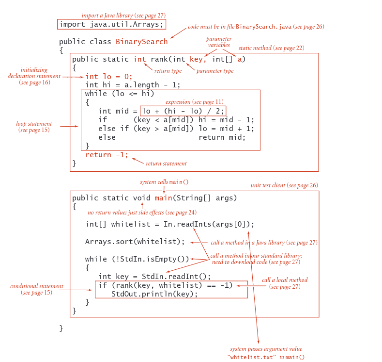
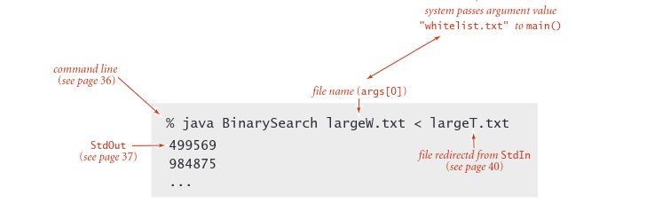
- Primitive data types, secara tepat mendefinisikan arti seperti bilangan bulat, bilangan real dan nilai boolean dalam program komputer. mereka juga bisa mencakup kumpulan nilai yang mungkin dapat dioperasikan manjadi ekspresi seperti ekspresi matematika yang mendefinisikan sebuah nilai
- Statement adalah memungkinkan kita mendefinisikan komputasi dengan menciptakan dan menetapkan nilai variable, mengendalikan aliran eksekusi atau menyebabkan efek samping. ada 6 jenis statement
  - declaration
  - assignment
  - conditional
  - loop
  - call
  - return
- Array adalah memungkinkan kita bekerja dengan beberapa nilai yang betipe sama
- Static method adalah memungkinkan kita merangkum dan menggunakan kembali kode serta mengembangkan program sebagai satu set modul dependenci
- String adalah rankaian karakter, Beberapa operasi pada mereka di bangun di Java
- Input/Output adalah mengatur komunikasi antara program dan dunia luar
- Data abstraction memperluas enkapsulasi dan penggunaan kembali untuk memungkinkan kita mendefinisikan tipe data primitif, sehingga mendukung program berorentasi objek

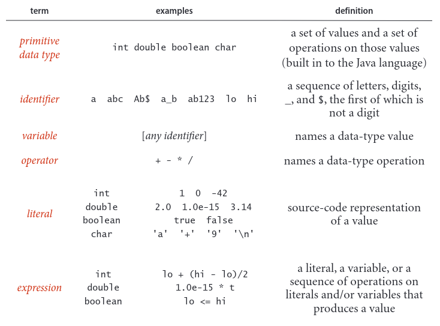

Untuk mendefinisikan tipe data, kita hanya perlu menentukan nilai dan rangkaian operasi pada nilai tersebut. Informasi ini dirangkum dalam tabel di bawah untuk tipe data Java int, double, boolean, dan char. Tipe data ini mirip dengan tipe data dasar yang ditemukan di banyak bahasa pemrograman. Untuk int dan double, operasinya sudah familiar
operasi aritmatika; untuk boolean, ini adalah operasi logika yang familiar. Penting untuk dicatat bahwa +, -, *, dan / kelebihan beban simbol yang sama menentukan operasi dalam beberapa tipe berbeda, bergantung pada konteks. Properti utama dari operasi primitif ini adalah bahwa operasi yang melibatkan nilai dari tipe tertentu memiliki nilai dari tipe tersebut. Aturan ini
menyoroti gagasan bahwa kita sering bekerja dengan nilai perkiraan, karena sering kali nilai eksak yang tampaknya ditentukan oleh ekspresi bukanlah nilai dari tipe tersebut. Misalnya, 5/3 memiliki nilai 1 dan 5.0/3.0 memiliki nilai yang sangat dekat dengan 1.66666666666667 namun tidak satu pun dari keduanya yang sama persis dengan 5/3. Tabel ini masih jauh dari lengkap; kami membahas beberapa operator tambahan dan berbagai situasi luar biasa yang terkadang perlu kami pertimbangkan dalam Tanya Jawab di akhir bagian ini.
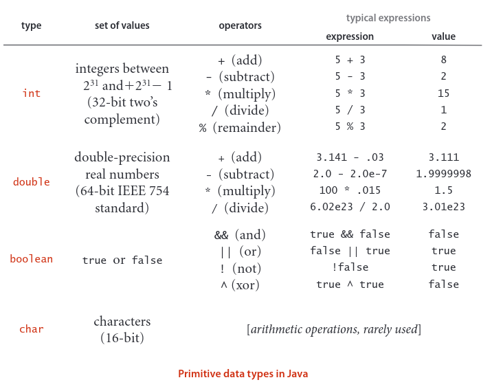

## Expression
Ekspresi. Seperti yang diilustrasikan dalam tabel di bagian bawah halaman sebelumnya, ekspresi tipikal adalah infiks: literal (atau ekspresi), diikuti oleh operator, diikuti oleh literal lain (atau ekspresi lain). Ketika sebuah ekspresi mengandung lebih dari satu operator, urutan penerapannya sering kali signifikan, sehingga konvensi prioritas berikut adalah bagian dari spesifikasi bahasa Java: Operator * dan / (dan %) memiliki prioritas lebih tinggi daripada (diterapkan sebelumnya) ) operator + dan - di antara operator logika, ! adalah prioritas tertinggi, diikuti oleh && dan kemudian ||. Umumnya, operator dengan prioritas yang sama diterapkan dari kiri ke kanan. Seperti dalam ekspresi aritmatika standar, Anda dapat menggunakan tanda kurung untuk mengesampingkan aturan ini. Karena aturan prioritas sedikit berbeda dari satu bahasa ke bahasa lain, kami menggunakan tanda kurung dan berusaha menghindari ketergantungan pada aturan prioritas dalam kode kami.

## Type conversion
Angka secara otomatis dipromosikan ke tipe yang lebih inklusif jika tidak
informasi hilang. Misalnya, dalam ekspresi 1 + 2.5 , 1 dipromosikan ke nilai ganda 1.0 dan ekspresi dievaluasi menjadi nilai ganda 3.5 . Pemeran adalah nama tipe dalam tanda kurung dalam ekspresi, arahan untuk mengubah nilai berikut menjadi nilai tipe tersebut. Misalnya (int) 3.7 adalah 3 dan (double) 3 adalah 3.0. Perhatikan itu
casting ke int adalah pemotongan, bukan pembulatan, aturan untuk casting dalam ekspresi yang rumit bisa jadi rumit, dan cast harus digunakan dengan hemat dan hati-hati. Praktik terbaiknya adalah menggunakan ekspresi yang melibatkan literal atau variabel bertipe tunggal.

## Comparisons
Operator berikut membandingkan dua nilai dengan tipe yang sama dan
menghasilkan nilai boolean: sama dengan (==), tidak sama dengan (!=), lebih kecil dari (<), lebih kecil atau sama dengan (<=), lebih besar dari (>), dan lebih besar atau sama dengan (>=). Operator ini dikenal sebagai operator tipe campuran karena nilainya boolean, bukan tipe nilai yang dibandingkan. Ekspresi dengan nilai boolean dikenal sebagai ekspresi boolean. Ekspresi tersebut merupakan komponen penting dalam pernyataan kondisional dan loop, seperti yang akan kita lihat

## Other primitive types
Int Java memiliki 232 nilai yang berbeda berdasarkan desain, sehingga dapat direpresentasikan dalam kata mesin 32-bit (banyak mesin saat ini memiliki kata-kata 64-bit, tetapi int 32-bit tetap ada). Demikian pula, standar ganda menentukan representasi 64-bit. Ukuran tipe data ini cukup untuk aplikasi tipikal yang menggunakan bilangan bulat dan bilangan real. Untuk memberikan fleksibilitas, Java memiliki lima tipe data primitif tambahan:
- 64-bit integers, with arithmetic operations (long)
- 16-bit integers, with arithmetic operations (short)
- 16-bit characters, with arithmetic operations (char)
- 8-bit integers, with arithmetic operations (byte)
- 32-bit single-precision real numbers, again with arithmetic operations (float)

Kami paling sering menggunakan operasi aritmatika int dan ganda dalam buku ini, jadi kami tidak mempertimbangkan operasi aritmatika lainnya (yang sangat mirip) secara lebih rinci di sini.

## Statements 
Program Java terdiri dari pernyataan-pernyataan, yang mendefinisikan komputasi dengan membuat dan memanipulasi variabel, menetapkan nilai tipe data padanya, dan mengendalikan aliran eksekusi operasi tersebut. Pernyataan sering kali disusun dalam blok, urutan pernyataan dalam kurung kurawal.

- Declarations Deklarasi membuat variabel dengan tipe tertentu dan menamainya dengan pengidentifikasi. 
- Assignments Penugasan mengasosiasikan nilai tipe data (didefinisikan oleh ekspresi) dengan variabel. Java juga memiliki beberapa idiom penugasan implisit untuk mengubah nilai nilai tipe data relatif terhadap nilainya saat ini, seperti menambah nilai variabel integer. 
- Conditionals Persyaratan menyediakan perubahan sederhana dalam alur eksekusi, mengeksekusi pernyataan di salah satu dari dua blok, bergantung pada kondisi yang ditentukan. 
- Loops Perulangan memberikan perubahan yang lebih besar dalam aliran eksekusi, mengeksekusi pernyataan dalam sebuah blok selama kondisi tertentu benar. 
- Calls Panggilan dan pengembalian berhubungan dengan metode statis (lihat halaman 22), yang menyediakan cara lain untuk mengubah alur eksekusi dan mengatur kode


Program adalah rangkaian pernyataan, dengan deklarasi, penugasan, kondisional, perulangan, panggilan, dan pengembalian. Program biasanya memiliki struktur bersarang: suatu pernyataan di antara pernyataan-pernyataan dalam suatu blok dalam suatu kondisi atau perulangan dapat berupa suatu kondisi atau perulangan. Misalnya, perulangan while pada rank() berisi pernyataan if. Selanjutnya, kita mempertimbangkan masing-masing jenis pernyataan ini secara bergantian.

Declarations. Pernyataan deklarasi mengaitkan nama variabel dengan tipe pada waktu kompilasi. Java mengharuskan kita menggunakan deklarasi untuk menentukan nama dan tipe variabel. Dengan melakukan hal ini, kami bersikap eksplisit tentang perhitungan apa pun yang kami tentukan. Java dikatakan sebagai bahasa yang diketik dengan kuat, karena compiler Java memeriksa konsistensinya (misalnya, Java tidak mengizinkan kita mengalikan boolean dan double).
Deklarasi dapat muncul dimana saja sebelum suatu variabel pertama kali digunakan. Paling sering, kita menempatkannya pada titik penggunaan pertama. Cakupan suatu variabel adalah bagian program yang mendefinisikannya. Umumnya ruang lingkup suatu variabel terdiri dari pernyataan-pernyataan yang mengikuti deklarasi di blok yang sama dengan deklarasi.

Assignments. Pernyataan penugasan mengaitkan nilai tipe data (didefinisikan oleh ekspresi) dengan variabel. Saat kita menulis c = a + b di Java, kita tidak menyatakan persamaan matematis, melainkan menyatakan suatu tindakan: tetapkan nilai variabel c menjadi nilai a ditambah nilai b. Memang benar bahwa c secara matematis sama dengan a + b segera setelah pernyataan penugasan dieksekusi, tetapi tujuan dari pernyataan tersebut adalah untuk mengubah nilai c (jika perlu). Sisi kiri pernyataan penugasan harus berupa variabel tunggal; sisi kanan dapat berupa ekspresi arbitrer yang menghasilkan nilai bertipe tersebut.

Conditionals. Kebanyakan komputasi memerlukan tindakan berbeda untuk input berbeda. Satu
cara untuk mengekspresikan perbedaan-perbedaan ini di Java adalah pernyataan if:
```java
if (/*boolean expression*/) {/*block statement*/}
```
Deskripsi ini memperkenalkan notasi formal yang dikenal sebagai templat yang kadang-kadang kita gunakan untuk menentukan format konstruksi Java. Kita masukkan ke dalam tanda kurung siku (< >) sebuah konstruksi yang telah kita definisikan, untuk menunjukkan bahwa kita dapat menggunakan instance apa pun dari konstruksi tersebut jika ditentukan. Dalam hal ini, <ekspresi boolean> mewakili sebuah
ekspresi yang memiliki nilai boolean, seperti yang melibatkan operasi perbandingan, dan < pernyataan blok> mewakili urutan pernyataan Java. Definisi formal dari <ekspresi boolean> dan <pernyataan blok> dapat dibuat, namun kami tidak akan membahasnya secara mendetail. Arti dari pernyataan if sudah cukup jelas: pernyataan dalam blok harus dieksekusi jika dan hanya jika ekspresi boolean benar. Pernyataan if-else:
```java
if (/*boolean expression*/) {/*block statement*/}
else {/*block statement*/}
```
memungkinkan untuk memilih antara dua blok pernyataan alternatif.

Loops. Banyak perhitungan yang pada dasarnya bersifat berulang. Konstruksi dasar Java untuk menangani komputasi tersebut memiliki format berikut:
```java
while (/*boolean expresion*/) {/*block statement*/}
```

Pernyataan while mempunyai bentuk yang sama dengan pernyataan if (satu-satunya perbedaan adalah penggunaan kata kunci while dan bukan if), namun maknanya cukup berbeda. Ini adalah instruksi kepada komputer untuk berperilaku sebagai berikut: jika ekspresi boolean salah, jangan lakukan apa pun; jika ekspresi boolean benar, jalankan rangkaian pernyataan di
blok (sama seperti if) tetapi kemudian periksa kembali ekspresi boolean, jalankan kembali urutan pernyataan di blok jika ekspresi boolean benar, dan lanjutkan selama ekspresi boolean benar. Kami merujuk pada pernyataan di blok dalam satu perulangan sebagai badan perulangan.

Break and continue. Beberapa situasi memerlukan aliran kendali yang sedikit lebih rumit
daripada yang disediakan oleh pernyataan dasar if dan while. Oleh karena itu, Java mendukung dua pernyataan tambahan untuk digunakan dalam perulangan while:
- Pernyataan break, yang segera keluar dari perulangan 
- Pernyataan continue, yang segera memulai iterasi perulangan berikutnya

Kami jarang menggunakan pernyataan-pernyataan ini dalam kode di buku ini (dan banyak programmer tidak pernah menggunakannya), namun pernyataan-pernyataan ini sangat menyederhanakan kode dalam kasus-kasus tertentu.

Shortcut notations
berikut beberapa cara untuk menyatakan perhitungan tertentu; kami mencari kode yang jelas, elegan, dan efisien. Kode tersebut sering kali memanfaatkan pintasan yang banyak digunakan berikut ini (yang ditemukan dalam banyak bahasa, tidak hanya Java).


Initializing declarations, Kita dapat menggabungkan deklarasi dengan tugas untuk menginisialisasi variabel pada saat yang sama saat variabel tersebut dideklarasikan (dibuat). Misalnya kode int i = 1; membuat variabel int bernama i dan memberinya nilai awal 1. Praktik terbaiknya adalah menggunakan mekanisme ini dekat dengan penggunaan pertama variabel tersebut (untuk membatasi cakupan).


Implicit assignments. Pintasan berikut tersedia jika tujuan kita adalah melakukannya
memodifikasi nilai variabel relatif terhadap nilainya saat ini:
- Operator kenaikan/penurunan: i++ sama dengan i = i + 1 dan mempunyai nilai i dalam sebuah ekspresi. Demikian pula, i-- sama dengan i = i - 1. Kode ++i dan --i sama, hanya saja nilai ekspresi diambil setelah kenaikan/penurunan, bukan sebelumnya. 
- Operasi gabungan lainnya: Menambahkan operator biner ke = dalam tugas sama dengan menggunakan variabel di sebelah kiri sebagai operan pertama. Misalnya kode i/=2; setara dengan kode i = i/2; Perhatikan bahwa saya += 1; mempunyai efek yang sama dengan i = i+1; (dan saya++).

Single-statement blocks Jika suatu blok pernyataan dalam kondisi atau perulangan hanya mempunyai satu pernyataan, kurung kurawal dapat dihilangkan.

For notation, Banyak perulangan mengikuti skema ini: menginisialisasi variabel indeks ke suatu nilai dan kemudian menggunakan perulangan while untuk menguji kondisi kelanjutan perulangan yang melibatkan variabel indeks, di mana pernyataan terakhir dalam perulangan while akan menambah variabel indeks. Anda dapat mengekspresikan loop tersebut secara kompak dengan notasi for Java:
```java
for (<initialize>; <boolean expression>; <increment>) {
    <block statements>
}
```
Kode ini, dengan hanya beberapa pengecualian, setara dengan
```java
<initialize>;
while (<boolean expression>) {
    <block statements>
    <increment>;
}
```
Kami menggunakan loop for untuk mendukung idiom pemrograman inisialisasi dan kenaikan ini.
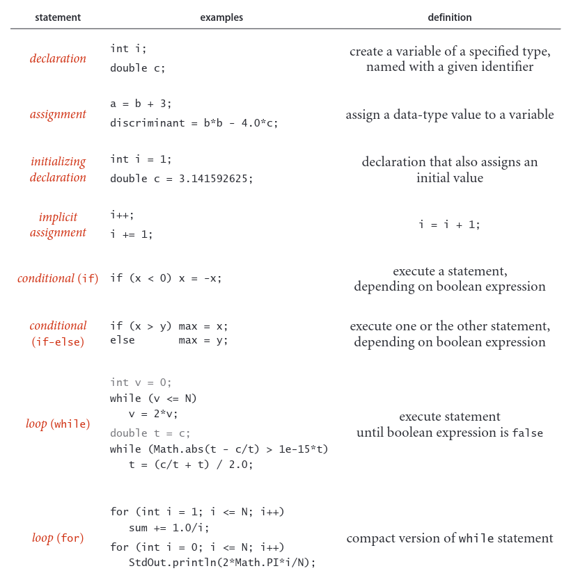
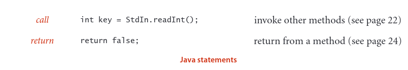

## Array
Array, Array menyimpan serangkaian nilai yang semuanya bertipe sama. Kami ingin tidak hanya menyimpan nilai tetapi juga mengakses setiap nilai individual. Metode yang kita gunakan untuk merujuk pada nilai individual dalam array adalah dengan memberi nomor dan kemudian mengindeksnya. Jika kita mempunyai nilai N, kita anggap nilai tersebut diberi nomor dari 0 hingga N-1. Kemudian, kita dapat dengan jelas menentukan salah satunya dalam kode Java dengan menggunakan notasi a[i] untuk merujuk pada nilai ke-i untuk setiap nilai i dari 0 hingga N-1. Konstruksi Java ini dikenal sebagai array satu dimensi.

## Creating and initializing an array.
Making an array in a Java program involves three distinct steps:
- Declare the array name and type.
- Create the array.
- Initialize the array values.

Untuk mendeklarasikan array, Anda perlu menentukan nama dan tipe data yang dikandungnya. Untuk membuatnya, Anda perlu menentukan panjangnya (jumlah nilai). Misalnya, kode “bentuk panjang” yang ditunjukkan di sebelah kanan membuat
array N angka bertipe double, semuanya diinisialisasi ke 0,0. Pernyataan pertama adalah deklarasi array. Ini seperti deklarasi variabel dengan tipe primitif yang sesuai kecuali persegi
tanda kurung mengikuti nama tipe, yang menentukan bahwa kita mendeklarasikan sebuah array. Kata kunci baru di status kedua-
ment adalah arahan Java untuk membuat array. Alasan kita perlu membuat array secara eksplisit pada saat run time adalah karena Java
kompiler tidak dapat mengetahui berapa banyak ruang yang harus dicadangkan untuk array pada waktu kompilasi (seperti halnya untuk nilai tipe primitif). Pernyataan for menginisialisasi nilai array N. Kode ini menyetel semua entri array ke nilai 0,0. Saat Anda mulai menulis kode yang menggunakan array, Anda harus yakin bahwa kode Anda mendeklarasikan, membuat, dan menginisialisasinya. Mengabaikan salah satu langkah ini adalah kesalahan pemrograman yang umum.
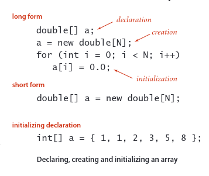

Short form, Untuk penghematan dalam kode, kita sering memanfaatkan konvensi inisialisasi array default Java dan menggabungkan ketiga langkah ke dalam satu pernyataan, seperti dalam kode “bentuk pendek” dalam contoh kita. Kode di sebelah kiri tanda sama dengan merupakan pernyataan; kode di sebelah kanan merupakan ciptaan. Perulangan for tidak diperlukan dalam kasus ini karena nilai awal default variabel bertipe double dalam array Java adalah 0,0, tetapi akan diperlukan jika nilai yang diinginkan bukan nol. Nilai awal default adalah nol untuk tipe numerik dan false untuk tipe boolean. Opsi ketiga yang ditampilkan pada contoh kita adalah menentukan nilai inisialisasi pada waktu kompilasi, dengan mencantumkan nilai literal di antara kurung kurawal, dipisahkan dengan koma.
## Using an array
Kode pemrosesan array yang umum ditampilkan di halaman 21. Setelah dideklarasikan
dan membuat array, Anda bisa merujuk ke nilai individual apa pun di mana pun Anda akan menggunakan nama variabel dalam program dengan mengapit indeks bilangan bulat dalam tanda kurung siku setelah nama array. Setelah kita membuat array, ukurannya tetap. Suatu program dapat merujuk pada panjang array a[] dengan kode a.length. Elemen terakhir dari array a[] selalu a[a.length-1]. Java melakukan pemeriksaan batas otomatis—jika Anda telah membuat array berukuran N dan menggunakan indeks yang nilainya kurang dari 0 atau lebih besar dari N-1, program Anda akan diakhiri dengan pengecualian runtime ArrayOutOfBoundsException.
## Aliasing
Perhatikan baik-baik bahwa nama array mengacu pada keseluruhan array. Jika kita menugaskan satu nama array ke nama array lainnya, maka keduanya merujuk ke array yang sama, seperti yang diilustrasikan dalam potongan kode berikut
```java
int[] a = new int[10] // [N]
a[1] = 1234;
int[] b = a;
b[1] = 5678; // a[1] is now 5678
```
Situasi ini dikenal sebagai aliasing dan dapat menyebabkan bug yang tidak kentara. Jika tujuan Anda adalah membuat salinan array, maka Anda perlu mendeklarasikan, membuat, dan menginisialisasi array baru, lalu menyalin semua entri dalam array asli ke array baru, seperti pada contoh ketiga di halaman 21.

## Two-dimensional arrays.
Array dua dimensi di Java adalah array dari array satu dimensi. Array dua dimensi mungkin acak-acakan (arraynya mungkin memiliki panjang yang berbeda-beda), namun kita paling sering bekerja dengan (untuk parameter yang sesuai M dan N) array dua dimensi M-kali-N yang merupakan array dengan M baris, masing-masing merupakan array dengan panjang N (jadi masuk akal juga untuk menyebut array memiliki N kolom). Memperluas konstruksi array Java untuk menangani array dua dimensi sangatlah mudah. Untuk merujuk pada entri pada baris i dan kolom j dari array dua dimensi a[][], kita menggunakan notasi a[i][j]; untuk mendeklarasikan array dua dimensi, kita menambahkan sepasang tanda kurung siku; dan untuk membuat array, kita menentukan jumlah baris diikuti dengan jumlah kolom setelah nama tipe (keduanya di dalam tanda kurung siku), sebagai berikut:
```java
double[][] a = new double[M][N];
```

Kami menyebut array seperti itu sebagai array M-by-N. Berdasarkan konvensi, dimensi pertama adalah jumlah baris dan dimensi kedua adalah jumlah kolom. Seperti halnya array satu dimensi, Java menginisialisasi semua entri dalam array bertipe numerik ke nol dan array dengan nilai boolean ke false. Inisialisasi default array dua dimensi berguna karena menutupi lebih banyak kode dibandingkan array satu dimensi. Kode berikut setara dengan idiom buat-dan-inisialisasi satu baris yang baru saja kita pertimbangkan:
```java
double[][] a;
a = new double[M][N];
for (int i = 0; i < M; i++) {
    for (int j = 0; j < N; j++) {
        a[i][j] = 0.0;
    }
}
```

Kode ini tidak berguna ketika menginisialisasi ke nol, tetapi loop for yang disarangkan diperlukan untuk menginisialisasi ke nilai lain.
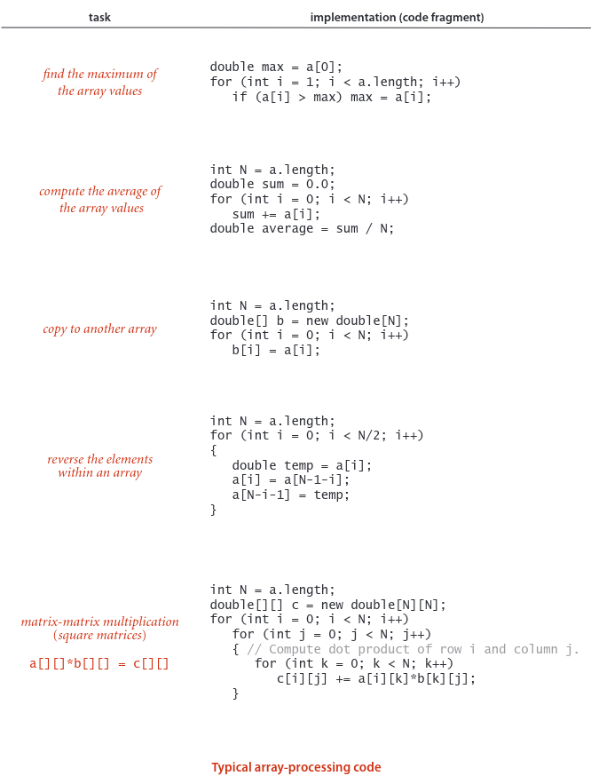

## Static methods
Setiap program Java dalam buku ini merupakan definisi tipe data (yang kami jelaskan secara rinci di Bagian 1.2) atau perpustakaan metode statis (yang kami jelaskan di sini). Metode statis disebut fungsi dalam banyak bahasa pemrograman, karena metode tersebut dapat berperilaku seperti fungsi matematika, seperti yang dijelaskan selanjutnya. Setiap metode statis adalah rangkaian pernyataan yang dieksekusi, satu demi satu, ketika metode statis dipanggil, dengan cara yang dijelaskan di bawah ini. Pengubah static membedakan metode ini dari metode instan, yang kita bahas di Bagian 1.2. Kita menggunakan kata metode tanpa pengubah ketika mendeskripsikan karakteristik yang dimiliki oleh kedua jenis metode tersebut.

## Defining a static method
Suatu metode merangkum komputasi yang didefinisikan sebagai rangkaian pernyataan. Suatu metode mengambil argumen (nilai dari tipe data tertentu) dan menghitung nilai kembalian dari beberapa tipe data yang bergantung pada argumen (seperti nilai yang ditentukan oleh fungsi matematika) atau menyebabkan efek samping yang bergantung pada argumen (seperti mencetak sebuah nilai). Metode statis rank() di BinarySearch


adalah contoh yang pertama; main() adalah contoh yang kedua. Setiap metode statis terdiri dari tanda tangan (kata kunci public static diikuti dengan tipe kembalian, nama metode, dan rangkaian argumen, masing-masing dengan tipe yang dideklarasikan) dan badan (blok pernyataan: rangkaian pernyataan, diapit dalam kurung kurawal). Contoh metode statis ditunjukkan pada tabel di halaman depan.

## Invoking a static method.
Panggilan pada metode statis adalah namanya diikuti dengan ekspresi yang menentukan nilai argumen dalam tanda kurung, dipisahkan dengan koma. Ketika pemanggilan metode merupakan bagian dari ekspresi, metode akan menghitung nilai dan nilai tersebut digunakan sebagai pengganti pemanggilan ekspresi. Misalnya panggilan pada rank() di BinarySearch() mengembalikan nilai int. Pemanggilan metode yang diikuti dengan titik koma adalah pernyataan yang umumnya menimbulkan efek samping. Misalnya, panggilan Arrays.sort() di main() di BinarySearch adalah panggilan pada metode sistem Arrays.sort() yang memiliki efek samping menempatkan entri dalam array dalam urutan yang diurutkan. Saat suatu metode dipanggil, variabel argumennya diinisialisasi dengan nilai ekspresi terkait dalam pemanggilan tersebut. Pernyataan return mengakhiri metode statis, mengembalikan kontrol ke pemanggil. Jika metode statis ingin menghitung suatu nilai, nilai tersebut harus ditentukan dalam pernyataan return (jika metode statis tersebut dapat mencapai akhir rangkaian pernyataannya tanpa pengembalian, kompilator akan melaporkan kesalahannya).
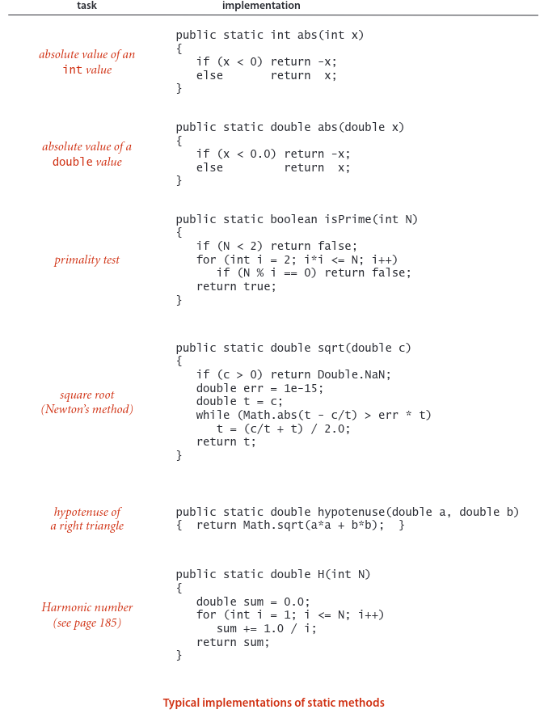

## Properties of methods.
Penjelasan rinci lengkap tentang sifat-sifat metode
berada di luar jangkauan kami, namun hal-hal berikut perlu diperhatikan:
- Argumen disampaikan berdasarkan nilai. Anda dapat menggunakan variabel argumen di mana saja dalam kode di badan metode dengan cara yang sama seperti Anda menggunakan variabel lokal. Satu-satunya perbedaan antara variabel argumen dan variabel lokal adalah bahwa variabel argumen diinisialisasi dengan nilai argumen yang diberikan oleh kode pemanggil. Metode ini bekerja berdasarkan nilai argumennya, bukan argumen itu sendiri. Salah satu konsekuensi dari pendekatan ini adalah mengubah nilai variabel argumen dalam metode statis tidak berpengaruh pada kode pemanggil. Secara umum, kami tidak mengubah variabel argumen dalam kode di buku ini. Konvensi pass by value menyiratkan bahwa argumen array diberi alias (lihat halaman 19)—metode ini menggunakan variabel argumen untuk merujuk ke array pemanggil dan dapat mengubah konten array (meskipun tidak dapat mengubah array itu sendiri). Misalnya, Arrays.sort() tentu saja mengubah konten array yang diteruskan sebagai argumen: ia menempatkan entri secara berurutan.
- Nama metode bisa kelebihan beban. Misalnya, perpustakaan Java Math menggunakan pendekatan ini untuk menyediakan implementasi Math.abs(), Math.min(), dan Math.max() untuk semua tipe numerik primitif. Kegunaan umum lainnya dari kelebihan beban adalah untuk mendefinisikan dua versi fungsi yang berbeda, versi yang menggunakan argumen dan versi lainnya yang menggunakan nilai default argumen tersebut.
- Suatu metode mempunyai nilai kembalian tunggal tetapi mungkin mempunyai beberapa pernyataan pengembalian. Metode Java hanya dapat memberikan satu nilai kembalian, dari tipe yang dideklarasikan dalam tanda tangan metode. Kontrol kembali ke program pemanggil segera setelah pernyataan return pertama dalam metode statis tercapai. Anda dapat meletakkan pernyataan pengembalian di mana pun Anda membutuhkannya. Meskipun mungkin ada beberapa pernyataan pengembalian, metode statis apa pun akan mengembalikan satu nilai setiap kali dipanggil: nilai setelah pernyataan pengembalian pertama yang ditemui.
- Suatu metode dapat mempunyai efek samping. Suatu metode dapat menggunakan kata kunci void sebagai tipe kembaliannya, untuk menunjukkan bahwa metode tersebut tidak memiliki nilai kembalian. Pengembalian eksplisit tidak diperlukan dalam metode statis void: kontrol kembali ke pemanggil setelah pernyataan terakhir. Metode void static dikatakan menghasilkan efek samping (mengkonsumsi input, menghasilkan output, mengubah entri dalam array, atau mengubah keadaan sistem). Misalnya, metode statis main() dalam program kita memiliki tipe pengembalian void karena tujuannya adalah untuk menghasilkan keluaran. Secara teknis, metode void tidak mengimplementasikan fungsi matematika (begitu juga dengan Math.random(), yang tidak memerlukan argumen namun menghasilkan nilai kembalian).

Metode contoh yang dibahas dalam Bagian 2.1 memiliki sifat yang sama, meskipun ada perbedaan besar dalam masalah efek samping.

## Recursion
Suatu metode dapat memanggil dirinya sendiri (jika Anda tidak nyaman dengan gagasan ini, yang dikenal sebagai rekursi, Anda dianjurkan untuk mengerjakan Latihan 1.1.16 hingga 1.1.22). Misalnya, kode di bagian bawah halaman ini memberikan implementasi alternatif metode rank() di BinarySearch. Kita sering menggunakan implementasi metode rekursif karena dapat menghasilkan kode yang ringkas dan elegan yang lebih mudah dipahami dibandingkan implementasi terkait yang tidak menggunakan rekursi. Misalnya, komentar dalam implementasi di bawah ini memberikan deskripsi singkat tentang apa yang seharusnya dilakukan kode tersebut. Kita dapat menggunakan komentar ini untuk meyakinkan diri kita sendiri bahwa ini berfungsi dengan benar,
dengan induksi matematika. Kami akan memperluas topik ini dan memberikan bukti pencarian biner di Bagian 3.1. Ada tiga aturan penting dalam mengembangkan program rekursif:
- Rekursi memiliki kasus dasar, kami selalu menyertakan pernyataan kondisional sebagai pernyataan pertama dalam program yang memiliki return
- Panggilan rekursif harus mengatasi submasalah yang lebih kecil, sehingga panggilan rekursif menyatu dengan kasus dasar. Pada kode di bawah ini, selisih nilai argumen keempat dan ketiga selalu mengecil.
- Panggilan rekursif tidak boleh mengatasi submasalah yang tumpang tindih. Pada kode di bawah, bagian larik yang direferensikan oleh kedua submasalah tersebut saling lepas.

Pelanggaran terhadap pedoman ini kemungkinan besar akan menghasilkan hasil yang salah atau program yang sangat tidak efisien (lihat Latihan 1.1.19 dan 1.1.27). Mematuhi pedoman ini kemungkinan besar akan menghasilkan program yang jelas dan benar, serta kinerjanya mudah dipahami. Alasan lain untuk menggunakan metode rekursif adalah karena metode tersebut mengarah pada model matematika yang dapat kita gunakan untuk memahami kinerja. Kami membahas masalah ini untuk pencarian biner di Bagian 3.2 dan beberapa contoh lainnya di seluruh buku ini.
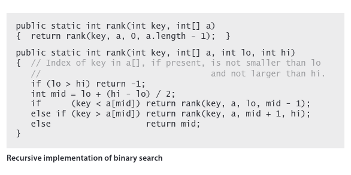

## Basic programming model
Pustaka metode statis adalah sekumpulan metode statis yang didefinisikan dalam kelas Java, dengan membuat file dengan kata kunci public class diikuti
dengan nama kelas, diikuti dengan metode statis, diapit kurung kurawal, disimpan dalam file dengan nama yang sama dengan kelas dan ekstensi .java. Model dasar pemrograman Java adalah mengembangkan program yang menangani tugas komputasi tertentu dengan membuat pustaka metode statis, salah satunya diberi nama main(). Mengetik java diikuti dengan nama kelas diikuti dengan urutan string akan memanggil main() di kelas tersebut, dengan array yang berisi string tersebut sebagai argumen. Setelah pernyataan terakhir di main() dijalankan, program berakhir. Dalam buku ini, ketika kita berbicara tentang program Java untuk menyelesaikan suatu tugas, kita berbicara tentang kode yang dikembangkan sesuai dengan hal tersebut (mungkin juga termasuk definisi tipe data, seperti yang dijelaskan dalam Bagian 1.2). Misalnya, BinarySearch adalah program Java yang terdiri dari dua metode statis, rank() dan main(), yang menyelesaikan tugas mencetak angka pada aliran input yang tidak ditemukan dalam file daftar putih yang diberikan sebagai argumen baris perintah.

## Modular programming.
Yang sangat penting dalam model ini adalah pustaka metode statis mengaktifkan pemrograman modular di mana kita membangun pustaka metode statis (modul) dan metode statis di satu pustaka dapat memanggil metode statis yang ditentukan di pustaka lain. Pendekatan ini memiliki banyak keuntungan penting. Itu memungkinkan kita untuk melakukannya
- Bekerja dengan modul berukuran wajar, bahkan dalam program yang melibatkan banyak kode
- Bagikan dan gunakan kembali kode tanpa harus menerapkannya kembali
- Gantikan implementasi yang ditingkatkan dengan mudah
- Kembangkan model abstrak yang sesuai untuk mengatasi masalah pemrograman
- Lokalkan debugging (lihat paragraf di bawah tentang pengujian unit)

Misalnya, BinarySearch memanfaatkan tiga perpustakaan lain yang dikembangkan secara independen, perpustakaan StdIn dan In kami serta perpustakaan Array Java. Masing-masing perpustakaan ini, pada gilirannya, memanfaatkan beberapa perpustakaan lainnya


## Unit testing.
Praktik terbaik dalam pemrograman Java adalah menyertakan main() di setiap pustaka metode statis yang menguji metode di pustaka (beberapa bahasa pemrograman lain melarang beberapa metode main() sehingga tidak mendukung pendekatan ini). Pengujian unit yang tepat dapat menjadi tantangan pemrograman yang signifikan. Minimal, setiap modul harus berisi metode main() yang menjalankan kode dalam modul dan memberikan jaminan bahwa kode tersebut berfungsi. Seiring dengan semakin matangnya sebuah modul, kami sering menyempurnakan metode main() menjadi klien pengembangan yang membantu kami melakukan pengujian yang lebih mendetail saat kami mengembangkan kode, atau klien pengujian yang menguji semua kode secara ekstensif. Ketika klien menjadi lebih rumit, kita mungkin memasukkannya ke dalam modul independen. Dalam buku ini, kami menggunakan main() untuk membantu mengilustrasikan tujuan setiap modul dan meninggalkan klien uji untuk latihan.

## External libraries.
Kami menggunakan metode statis dari empat jenis perpustakaan yang berbeda, masing-masing memerlukan prosedur (sedikit) berbeda untuk penggunaan kembali kode. Sebagian besar merupakan pustaka metode statis, namun ada juga yang merupakan definisi tipe data yang juga menyertakan beberapa metode statis.
- Pustaka sistem standar java.lang.*. Ini termasuk Matematika, yang berisi metode untuk fungsi matematika yang umum digunakan; Integer dan Double, yang kita gunakan untuk mengkonversi antara string karakter dan nilai int dan double; String dan StringBuilder, yang akan kita bahas secara rinci nanti di bagian ini dan di Bab 5; dan puluhan perpustakaan lain yang tidak kami gunakan.
- Pustaka sistem yang diimpor seperti Java.util.Arrays. Ada ribuan perpustakaan seperti itu dalam rilis standar Java, namun kami jarang menggunakannya dalam buku ini. Pernyataan import di awal program diperlukan untuk menggunakan perpustakaan tersebut (dan menandakan bahwa kita sedang melakukannya).
- Perpustakaan lain dalam buku ini. Misalnya program lain bisa
  gunakan peringkat() di BinarySearch. Untuk menggunakan program seperti itu, unduh sumbernya dari situs buku ke direktori kerja Anda.
- Perpustakaan standar Std* yang telah kami kembangkan untuk digunakan dalam buku ini (dan buku pengantar kami Pengantar Pemrograman di Java: Pendekatan Interdisipliner). Pustaka-pustaka tersebut dirangkum dalam beberapa halaman berikut. Kode sumber dan instruksi untuk mendownloadnya tersedia di situs buku.
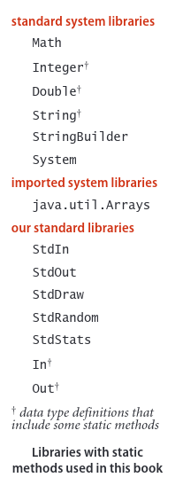

Untuk memanggil metode dari perpustakaan lain (satu di direktori yang sama
atau direktori tertentu, perpustakaan sistem standar, atau perpustakaan sistem
yang disebutkan dalam pernyataan import sebelum definisi kelas), we
tambahkan nama perpustakaan ke nama metode untuk setiap panggilan. Misalnya, metode main() di BinarySearch memanggil metode sort()
di perpustakaan sistem java.util.Arrays, metode readInts() di
perpustakaan kami Di, dan metode println() di perpustakaan kami StdOut.


Pustaka metode yang diterapkan oleh kami dan orang lain dalam lingkungan pemrograman modular dapat memperluas cakupan model pemrograman kami. Di luar semua perpustakaan yang tersedia dalam rilis Java standar, ribuan perpustakaan lainnya tersedia di web untuk segala jenis aplikasi. Untuk membatasi cakupan model pemrograman kami ke ukuran yang dapat dikelola sehingga kami dapat berkonsentrasi pada algoritme, kami hanya menggunakan pustaka yang tercantum dalam tabel di kanan halaman ini, dengan subset metodenya tercantum dalam API, seperti yang dijelaskan selanjutnya.

API Komponen penting dari pemrograman modular adalah dokumentasi yang menjelaskan pengoperasian metode perpustakaan yang dimaksudkan untuk digunakan oleh orang lain. Kami akan secara konsisten menjelaskan metode perpustakaan yang kami gunakan dalam buku ini dalam antarmuka pemrograman aplikasi (API) yang mencantumkan nama perpustakaan dan tanda tangan serta deskripsi singkat dari setiap metode yang kami gunakan. Kami menggunakan istilah klien untuk merujuk pada program yang memanggil metode di perpustakaan lain dan istilah implementasi untuk menggambarkan kode Java yang mengimplementasikan metode dalam API.

Contoh. Contoh berikut, API untuk metode statis yang umum digunakan dari pustaka Matematika standar di java.lang, mengilustrasikan konvensi kami untuk API:

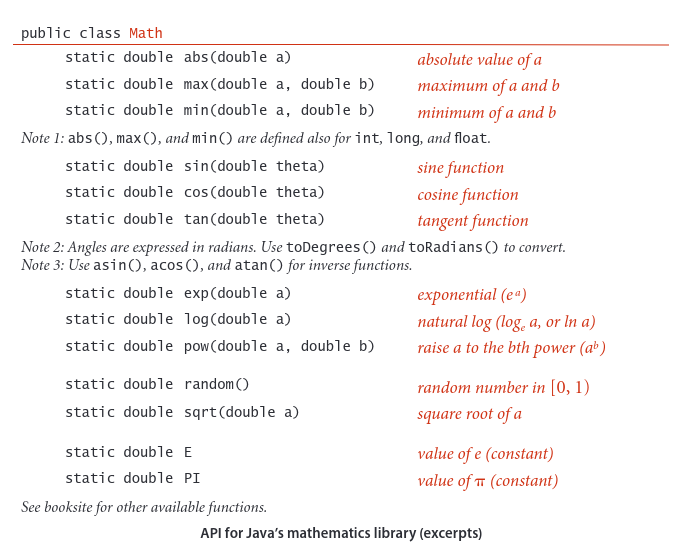

Metode ini mengimplementasikan fungsi matematika—metode ini menggunakan argumennya untuk menghitung nilai dengan tipe tertentu (kecuali random(), yang tidak mengimplementasikan fungsi matematika karena tidak memerlukan argumen). Karena semuanya beroperasi pada nilai ganda dan menghitung hasil ganda, Anda dapat menganggapnya sebagai perluasan tipe data ganda. Ekstensibilitas seperti ini adalah salah satu fitur karakteristik bahasa pemrograman modern. Setiap metode dijelaskan oleh sebuah baris di API yang menentukan informasi yang perlu Anda ketahui untuk menggunakan metode tersebut. Pustaka Matematika juga mendefinisikan nilai konstanta yang tepat PI (untuk ) dan E (untuk e), sehingga Anda bisa
gunakan nama tersebut untuk merujuk pada konstanta tersebut dalam program Anda. Misalnya, nilai Math.sin(Math.PI/2) adalah 1,0 dan nilai Math.log(Math.E) adalah 1,0 (karena Math.sin() mengambil argumennya dalam radian dan Math.log() mengimplementasikan fungsi logaritma natural).

perpustakaan Java. Deskripsi online yang ekstensif dari ribuan perpustakaan merupakan bagian dari setiap rilis Java, namun kami hanya mengutip beberapa metode yang kami gunakan dalam buku ini, untuk menggambarkan dengan jelas model pemrograman kami. Misalnya, BinarySearch menggunakan metode sort() dari pustaka Array Java, yang kami dokumentasikan sebagai berikut
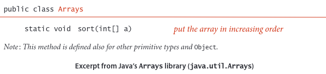
Pustaka Array tidak ada di java.lang, jadi diperlukan pernyataan import untuk menggunakannya, seperti di BinarySearch. Sebenarnya, Bab 2 buku ini dikhususkan untuk implementasi sort() untuk array, termasuk algoritma mergesort dan quicksort yang diimplementasikan dalam Arrays.sort(). Banyak algoritma dasar yang kita bahas dalam buku ini diimplementasikan di Java dan banyak lingkungan pemrograman lainnya. Misalnya, Array juga menyertakan implementasi pencarian biner. Untuk menghindari kebingungan, kami biasanya menggunakan implementasi kami sendiri, meskipun tidak ada salahnya menggunakan implementasi perpustakaan yang telah disesuaikan dengan algoritma yang Anda pahami.

Perpustakaan standar kami. Kami telah mengembangkan sejumlah perpustakaan yang menyediakan fungsionalitas berguna untuk pengenalan pemrograman Java, untuk aplikasi ilmiah, dan untuk pengembangan, studi, dan penerapan algoritma. Sebagian besar perpustakaan ini ditujukan untuk input dan output; kami juga menggunakan dua perpustakaan berikut untuk menguji dan menganalisis implementasi kami. Yang pertama memperluas Math.random() untuk memungkinkan kita mengambil nilai acak dari berbagai distribusi; yang kedua mendukung perhitungan statistik:
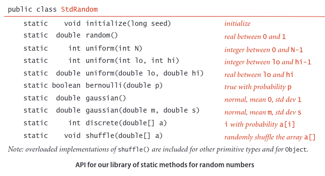

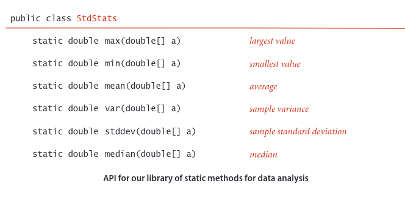

Metode inisialisasi() di StdRandom memungkinkan kita menyemai penghasil bilangan acak sehingga kita dapat mereproduksi eksperimen yang melibatkan bilangan acak. Sebagai referensi, penerapan sebagian besar metode ini diberikan di halaman 32. Beberapa metode ini sangat mudah diterapkan; mengapa kita repot-repot memasukkannya ke perpustakaan? Jawaban atas pertanyaan ini adalah standar untuk perpustakaan yang dirancang dengan baik:
- Mereka menerapkan tingkat abstraksi yang memungkinkan kita fokus pada penerapan dan pengujian algoritme dalam buku, bukan menghasilkan objek acak atau menghitung statistik. Kode klien yang menggunakan metode seperti itu lebih jelas dan mudah dipahami dibandingkan kode buatan sendiri yang melakukan perhitungan yang sama.
- Implementasi perpustakaan diuji untuk kondisi luar biasa, mencakup situasi yang jarang ditemui, dan tunduk pada pengujian ekstensif, sehingga kami dapat mengandalkannya untuk beroperasi sesuai harapan. Implementasi seperti itu mungkin melibatkan sejumlah besar kode. Misalnya, kita sering menginginkan implementasi untuk berbagai tipe data. Misalnya, pustaka Array Java menyertakan beberapa implementasi sort() yang kelebihan beban, satu implementasi untuk setiap tipe data yang mungkin perlu Anda urutkan.

Ini adalah pertimbangan dasar untuk pemrograman modular di Java, tapi mungkin agak berlebihan dalam kasus ini. Meskipun metode di kedua perpustakaan ini pada dasarnya mendokumentasikan diri sendiri dan banyak di antaranya tidak sulit untuk diterapkan, beberapa di antaranya mewakili latihan algoritmik yang menarik. Oleh karena itu, Anda disarankan untuk mempelajari kode di StdRandom.java dan StdStats.java di situs buku dan memanfaatkan implementasi yang telah terbukti benar ini. Cara termudah untuk menggunakan perpustakaan ini (dan memeriksa kodenya) adalah dengan mengunduh kode sumber dari situs buku dan meletakkannya di direktori kerja Anda; berbagai mekanisme yang bergantung pada sistem untuk menggunakannya tanpa membuat banyak salinan juga dijelaskan di situs buku

## Your own libraries
Penting untuk mempertimbangkan setiap program yang Anda tulis sebagai implementasi perpustakaan, untuk kemungkinan digunakan kembali di masa mendatang.
- Menulis kode untuk klien, implementasi tingkat atas yang memecah komputasi menjadi beberapa bagian yang dapat dikelola.
- Mengartikulasikan API untuk perpustakaan (atau beberapa API untuk beberapa perpustakaan) metode statis yang dapat menangani setiap bagian.
- Kembangkan implementasi API, dengan main() yang menguji metode independen dari klien

Pendekatan ini tidak hanya memberi Anda perangkat lunak berharga yang nantinya dapat Anda gunakan kembali, namun juga memanfaatkan pemrograman modular dengan cara ini adalah kunci untuk berhasil mengatasi tugas pemrograman yang kompleks.

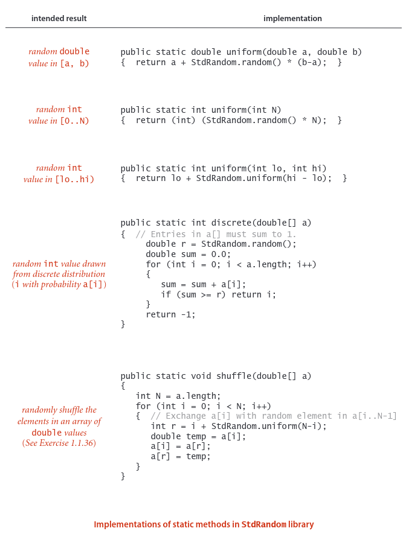

Tujuan API adalah untuk memisahkan klien dari implementasi: klien tidak boleh mengetahui apa pun tentang implementasi selain informasi yang diberikan dalam API, dan implementasi tidak boleh mengambil properti klien tertentu ke dalamnya.
akun. API memungkinkan kami mengembangkan kode secara terpisah untuk berbagai tujuan, lalu menggunakannya kembali secara luas. Tidak ada perpustakaan Java yang dapat memuat semua metode yang mungkin kita perlukan untuk komputasi tertentu, jadi kemampuan ini merupakan langkah penting dalam menangani aplikasi pemrograman yang kompleks. Oleh karena itu, pemrogram biasanya menganggap API sebagai kontrak antara klien dan implementasi yang merupakan spesifikasi jelas tentang apa yang harus dilakukan setiap metode. Tujuan kami saat mengembangkan implementasi adalah untuk menghormati ketentuan kontrak. Seringkali, ada banyak cara untuk melakukannya, dan memisahkan kode klien dari implementasi
kode memberi kita kebebasan untuk mengganti implementasi yang baru dan lebih baik. Dalam studi algoritma, kemampuan ini merupakan unsur penting dalam kemampuan kita memahami dampak perbaikan algoritma yang kita kembangkan.

## Strings
String adalah urutan karakter (nilai char). String literal adalah a
urutan karakter dalam tanda kutip ganda, seperti "Halo, Dunia". Tipe data String adalah tipe data Java tetapi bukan tipe primitif. Kami mempertimbangkan String sekarang karena ini adalah tipe data mendasar yang digunakan hampir setiap program Java.

## Concatenation.
Java memiliki operator penggabungan bawaan (+) untuk String seperti
operator bawaan yang dimilikinya untuk tipe primitif, membenarkan penambahan baris pada tabel di bawah ke tabel tipe primitif di halaman 12. Hasil penggabungan dua nilai String adalah nilai String tunggal, string pertama diikuti oleh nilai String Kedua.
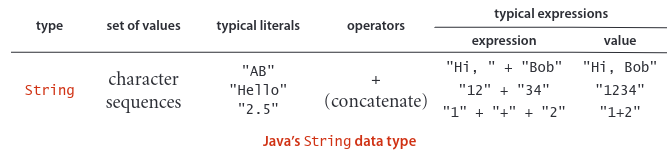

## Conversion
Dua kegunaan utama string adalah untuk mengkonversi nilai yang bisa kita masukkan pada keyboard menjadi nilai tipe data dan untuk mengkonversi nilai tipe data menjadi nilai yang bisa kita baca di layar. Java memiliki operasi bawaan untuk String untuk memfasilitasi operasi ini.
Secara khusus, bahasa ini mencakup perpustakaan Integer dan Double yang berisi metode statis untuk mengkonversi antara nilai String dan nilai int dan antara nilai String dan nilai double, masing-masing.
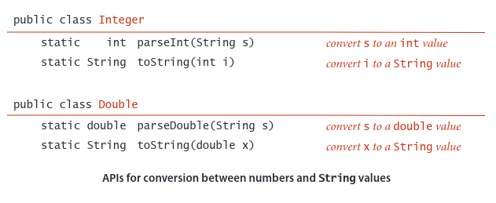

## Automatic conversion. 
Kita jarang secara eksplisit menggunakan metode statis toString() yang baru saja dijelaskan karena Java memiliki mekanisme bawaan yang memungkinkan kita mengonversi nilai tipe data apa pun ke nilai String dengan menggunakan penggabungan: jika salah satu argumen + adalah String, Java secara otomatis mengubah argumen lain menjadi sebuah String (jika argumen tersebut belum menjadi sebuah String). Di luar penggunaan seperti "Akar kuadrat dari 2.0 adalah " + Math.sqrt(2.0) mekanisme ini memungkinkan konversi nilai tipe data apa pun menjadi sebuah String, dengan menggabungkannya dengan string kosong "".

## Command-line arguments.
Salah satu kegunaan penting string dalam pemrograman Java adalah untuk mengaktifkan mekanisme penyampaian informasi dari baris perintah ke program.
Mekanismenya sederhana. Saat Anda mengetikkan perintah java diikuti dengan nama perpustakaan diikuti dengan urutan string, sistem Java akan memanggil metode main() di perpustakaan tersebut dengan array string sebagai argumen: string yang diketik setelah nama perpustakaan. Misalnya, metode main() di BinarySearch mengambil satu argumen baris perintah,
jadi sistem membuat array berukuran satu. Program ini menggunakan nilai tersebut, args[0], untuk memberi nama file yang berisi daftar putih, untuk digunakan sebagai argumen ke In.readInts(). Paradigma khas lainnya yang sering kita gunakan dalam kode kita adalah ketika argumen baris perintah dimaksudkan untuk mewakili angka, jadi kita menggunakan parseInt() untuk mengonversi ke nilai int atau parseDouble() untuk mengonversi ke nilai ganda.


Komputasi dengan string merupakan komponen penting dari komputasi modern. Untuk saat ini, kami menggunakan String hanya untuk mengkonversi antara representasi eksternal angka sebagai rangkaian karakter dan representasi internal nilai tipe data numerik. Di Bagian 1.2, kita akan melihat bahwa Java mendukung lebih banyak lagi operasi pada nilai String yang kita gunakan di seluruh buku ini; di Bagian 1.4, kita akan memeriksa representasi internal nilai String; dan di Bab 5, kami membahas secara mendalam algoritma yang memproses data String. Algoritme ini adalah salah satu metode paling menarik, rumit, dan berdampak yang kami bahas dalam buku ini.

## Input and output 
Tujuan utama perpustakaan standar kami untuk input, output, dan gambar adalah untuk mendukung model sederhana program Java untuk berinteraksi dengan dunia luar. Pustaka ini dibangun berdasarkan kemampuan ekstensif yang tersedia di pustaka Java, namun umumnya jauh lebih rumit dan lebih sulit dipelajari dan digunakan. Kita mulai dengan meninjau secara singkat model tersebut. Dalam model kami, program Java mengambil nilai masukan dari argumen baris perintah atau dari aliran karakter abstrak yang dikenal sebagai aliran masukan standar dan menulis ke aliran karakter abstrak lain yang dikenal sebagai aliran keluaran standar.

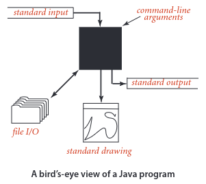


Kita perlu mempertimbangkan antarmuka antara Java dan sistem operasi, jadi kita perlu membahas secara singkat mekanisme dasar yang disediakan oleh sebagian besar sistem operasi modern dan lingkungan pengembangan program. Anda dapat menemukan rincian lebih lanjut tentang sistem khusus Anda di situs buku. Secara default, argumen baris perintah, masukan standar, dan keluaran standar dikaitkan
dengan aplikasi yang didukung oleh sistem operasi atau lingkungan pengembangan program yang mengambil perintah. Kami menggunakan istilah umum jendela terminal untuk merujuk pada jendela yang dikelola oleh aplikasi ini, tempat kami mengetik dan membaca teks. Sejak awal sistem Unix pada tahun 1970an, model ini telah terbukti menjadi cara yang nyaman dan langsung bagi kita untuk berinteraksi dengan program dan data. Kami menambahkan gambar standar ke model klasik yang memungkinkan kami membuat representasi visual untuk analisis data.

## Commands and arguments. 
Di jendela terminal, kita melihat prompt, di mana kita mengetikkan perintah ke sistem operasi yang mungkin memerlukan argumen. Kami hanya menggunakan beberapa perintah dalam buku ini, yang ditunjukkan pada tabel di bawah. Paling sering, kita menggunakan perintah .java, untuk menjalankan program kita. Seperti disebutkan di halaman 35, kelas Java memiliki metode statis main() yang menggunakan array String args[] sebagai argumennya. Array tersebut adalah urutan argumen baris perintah yang kita ketik, disediakan untuk Java oleh sistem operasi.
Berdasarkan konvensi, baik Java maupun proses sistem operasi
argumen sebagai string. Jika kita bermaksud untuk berdebat
menjadi angka, kita menggunakan metode seperti Integer.parseInt()
untuk mengubahnya dari String ke tipe yang sesuai.

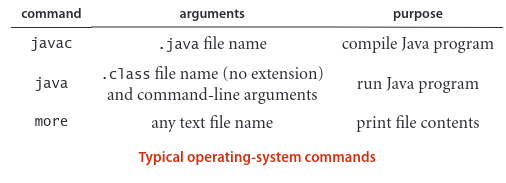


Keluaran standar. Pustaka StdOut kami menyediakan dukungan untuk keluaran standar. Secara default, sistem menghubungkan output standar ke jendela terminal. Metode print() menempatkan argumennya pada keluaran standar; metode println() menambahkan baris baru; dan metode printf() mendukung keluaran yang diformat, seperti dijelaskan selanjutnya. Java menyediakan metode serupa di perpustakaan System.out-nya; kami menggunakan StdOut untuk menangani standar
input dan output standar dengan cara yang seragam (dan untuk memberikan beberapa perbaikan teknis).
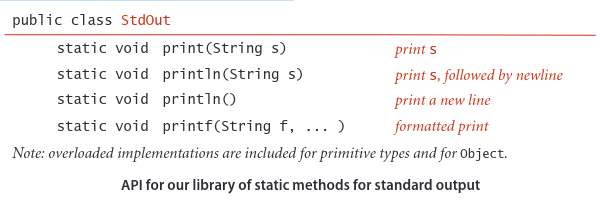

Untuk menggunakan metode ini, unduh ke direktori kerja Anda StdOut.java dari situs buku dan gunakan kode seperti StdOut.println("Hello, World"); untuk memanggil mereka. Contoh klien ditampilkan di sebelah kanan.
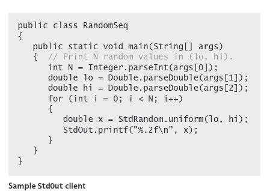

Keluaran yang diformat. Dalam bentuknya yang paling sederhana, printf() membutuhkan dua argumen.
Argumen pertama adalah format string yang menjelaskan bagaimana argumen kedua dikonversi menjadi string untuk keluaran. Jenis format string yang paling sederhana dimulai dengan % dan diakhiri dengan kode konversi satu huruf. Kode konversi yang paling sering kami gunakan adalah d (untuk nilai desimal dari tipe integer Java), f (untuk nilai floating-point), dan s (untuk nilai String). Antara % dan kode konversi
adalah nilai integer yang menentukan lebar bidang dari nilai yang dikonversi (jumlah karakter dalam string keluaran yang dikonversi). Secara default,
spasi kosong ditambahkan di sebelah kiri untuk membuat panjang keluaran yang dikonversi sama dengan lebar bidang; jika kita ingin spasi disebelah kanan, kita bisa menyisipkan tanda minus sebelum lebar field. (Jika string keluaran yang dikonversi lebih besar dari lebar bidang, lebar bidang akan diabaikan.) Mengikuti lebarnya, kita memiliki opsi untuk menyertakan titik diikuti dengan jumlah digit yang ditempatkan setelah koma desimal (presisi) untuk a nilai ganda atau jumlah karakter yang diambil dari awal string untuk nilai String. Hal terpenting yang perlu diingat tentang penggunaan printf() adalah kode konversi dalam format dan tipe argumen terkait harus cocok. Artinya, Java harus dapat mengkonversi dari tipe argumen ke tipe yang dibutuhkan oleh kode konversi. Argumen pertama printf() adalah String yang mungkin berisi karakter selain format string. Setiap bagian dari argumen yang bukan bagian dari format string diteruskan ke output, dengan format string diganti dengan nilai argumen (dikonversi menjadi String seperti yang ditentukan). Misalnya pernyataan

```java
StdOut.printf("PI is approximately %.2f\n", Math.PI);
```

prints the line
```shell
PI is approximately 3.14
```

Perhatikan bahwa kita perlu secara eksplisit menyertakan karakter baris baru \n dalam argumen untuk mencetak baris baru dengan printf(). Fungsi printf() dapat memerlukan lebih dari dua argumen. Dalam hal ini, string format akan memiliki penentu format untuk setiap argumen tambahan, mungkin dipisahkan oleh karakter lain untuk diteruskan ke output. Anda juga dapat menggunakan metode statis String.format() dengan argumen persis seperti itu
baru saja dijelaskan untuk printf() untuk mendapatkan string yang diformat tanpa mencetaknya. Pencetakan terformat adalah mekanisme mudah yang memungkinkan kami mengembangkan kode ringkas yang dapat menghasilkan data eksperimen yang ditabulasikan (penggunaan utama kami dalam buku ini).


## Standard input. 
Perpustakaan StdIn kami mengambil data dari input standar
aliran yang mungkin kosong atau mungkin berisi urutan nilai yang dipisahkan
diberi peringkat berdasarkan spasi (spasi, tab, karakter baris baru, dan sejenisnya). Oleh
default, sistem menghubungkan output standar ke jendela terminal yang Anda ketik adalah aliran input (diakhiri dengan <ctrl-d> atau
<ctrl-z>, tergantung pada aplikasi jendela terminal Anda). Setiap nilai
adalah sebuah String atau nilai dari salah satu tipe primitif Java. Salah satu kuncinya
Fitur aliran input standar adalah program Anda menggunakan nilai saat membacanya. Setelah program Anda membaca suatu nilai, program tersebut tidak dapat mencadangkan dan membacanya lagi. Asumsi ini bersifat membatasi, namun mencerminkan karakteristik fisik beberapa perangkat masukan dan menyederhanakan penerapan abstraksi. Dalam model aliran masukan, metode statis di perpustakaan ini sebagian besar terdokumentasi sendiri (dijelaskan dengan tanda tangannya).

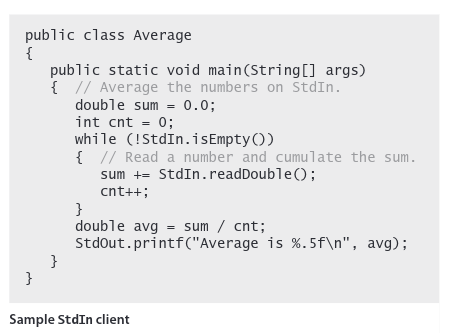
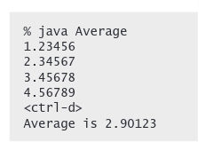
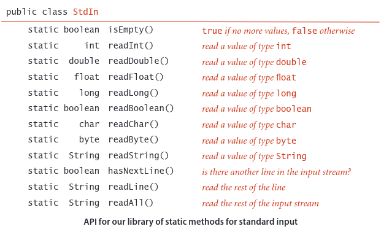

## Redirection and piping. 
Input dan output standar memungkinkan kami memanfaatkan ekstensi baris perintah yang didukung oleh banyak sistem operasi. Dengan menambahkan arahan sederhana ke perintah yang memanggil suatu program, kita dapat mengarahkan output standarnya ke sebuah file, baik untuk penyimpanan permanen atau untuk input ke program lain di lain waktu:
```java
java RandomSeq 1000 100.0 200.0 > data.txt
```
Perintah ini menetapkan bahwa aliran keluaran standar tidak untuk dicetak di jendela terminal, melainkan untuk ditulis ke file teks bernama data.txt. Setiap panggilan ke StdOut.print() atau StdOut.println()
menambahkan teks di akhir file itu. Dalam contoh ini, hasil akhirnya adalah file yang berisi 1.000 nilai acak. Tidak ada output yang muncul di jendela terminal: output langsung masuk ke file yang diberi nama
simbol >. Dengan demikian, kita dapat menyimpan informasi untuk diambil nanti. Bukan berarti kita tidak perlu mengubah RandomSeq
bagaimanapun ia menggunakan abstraksi keluaran standar dan tidak terpengaruh oleh penggunaan implementasi abstraksi yang berbeda. Demikian pula, kita dapat mengarahkan input standar sehingga StdIn membaca data dari file, bukan dari aplikasi terminal
```java
java Average < data.txt
```

Perintah ini membaca urutan angka dari file data.txt dan
menghitung nilai rata-ratanya. Secara khusus, simbol < adalah arahan yang memberitahu sistem operasi untuk mengimplementasikan aliran input standar dengan membaca dari file teks data.txt alih-alih menunggu pengguna mengetikkan sesuatu ke jendela terminal. Saat program memanggil StdIn.readDouble(), sistem operasi membaca nilai dari file. Menggabungkan hal-hal ini untuk mengarahkan output dari satu program ke input program lain dikenal sebagai piping:
```java
java RandomSeq 1000 100.0 200.0 | java Average
```
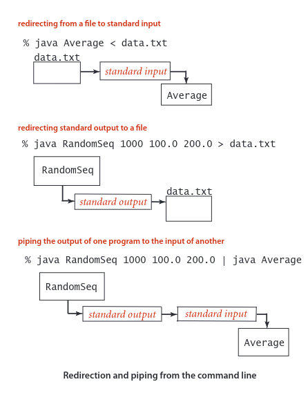

Perintah ini menetapkan bahwa keluaran standar untuk RandomSeq dan masukan standar untuk Rata-rata adalah aliran yang sama. Efeknya seolah-olah RandomSeq sedang mengetikkan angka-angka yang dihasilkannya ke jendela terminal saat Rata-rata sedang berjalan. Perbedaan ini sangat besar, karena menghilangkan batasan ukuran aliran masukan dan keluaran yang dapat kita proses. Misalnya, kita dapat mengganti 1000 dalam contoh kita dengan 1000000000, meskipun kita mungkin tidak memiliki ruang untuk menyimpan satu miliar angka di komputer kita (kita memerlukan waktu untuk memprosesnya). Saat RandomSeq memanggil StdOut.println(), sebuah string ditambahkan ke akhir aliran; ketika Rata-rata memanggil StdIn.readInt(), sebuah string dihapus dari awal aliran. Waktu yang tepat untuk melakukan apa yang akan terjadi bergantung pada sistem operasi: sistem operasi dapat menjalankan RandomSeq hingga menghasilkan beberapa keluaran, lalu menjalankan Rata-rata untuk menggunakan keluaran tersebut, atau dapat menjalankan Rata-rata hingga memerlukan keluaran, lalu menjalankan RandomSeq hingga menghasilkan keluaran yang dibutuhkan. Hasil akhirnya sama, tetapi program kami bebas dari kekhawatiran tentang detail tersebut karena program tersebut hanya bekerja dengan abstraksi masukan standar dan keluaran standar.

## Input and output from a file.
Perpustakaan Masuk dan Keluar kami menyediakan metode statis itu
mengimplementasikan abstraksi membaca dari dan menulis ke file isi array nilai tipe primitif (atau String). Kami menggunakan readInts(), readDoubles(), dan readStrings() di perpustakaan In dan writeInts(), writeDoubles(), dan writeStrings() di perpustakaan Out. Argumen bernama dapat berupa file atau halaman web. Misalnya, kemampuan ini memungkinkan kita menggunakan file dan input standar untuk dua tujuan berbeda dalam program yang sama, seperti di BinarySearch. Pustaka Masuk dan Keluar juga mengimplementasikan tipe data dengan metode instan yang memungkinkan kita memiliki kemampuan yang lebih umum untuk memperlakukan banyak file sebagai aliran masukan dan keluaran, dan halaman web sebagai aliran masukan, jadi kita akan meninjaunya kembali di Bagian 1.2.
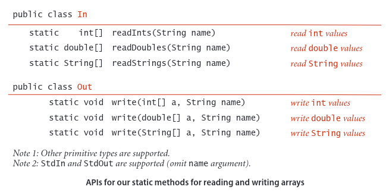

## Standard drawing (basic methods).
Hingga saat ini, abstraksi input/output kami terfokus secara eksklusif
pada string teks. Sekarang kami memperkenalkan abstraksi untuk menghasilkan gambar sebagai keluaran. Perpustakaan ini mudah digunakan dan memungkinkan kita memanfaatkan media visual untuk menampung lebih banyak informasi dibandingkan hanya dengan teks. Seperti halnya input/output standar, abstraksi gambar standar kami diimplementasikan di perpustakaan StdDraw yang dapat Anda akses dengan mengunduh file StdDraw.java dari situs buku ke direktori kerja Anda. Pengundian standar sangat sederhana: kita bayangkan sebuah
alat menggambar abstrak yang mampu menggambar garis dan titik pada kanvas dua dimensi. Perangkat ini mampu merespons perintah untuk menggambar bentuk geometris dasar yang dikeluarkan program kami dalam bentuk panggilan ke metode statis di StdDraw, termasuk metode untuk menggambar garis, titik, string teks, lingkaran, persegi panjang, dan poligon. Seperti metode untuk input standar dan output standar, metode ini hampir terdokumentasi sendiri: StdDraw.line() menggambar garis lurus
ruas garis yang menghubungkan titik (x0 , y0) dengan titik (x1 , y1 ) yang koordinatnya diberikan sebagai argumen. StdDraw.point() menggambar titik yang berpusat pada titik (x, y) yang koordinatnya diberikan sebagai argumen, dan seterusnya, seperti yang diilustrasikan dalam diagram di sebelah kanan. Bentuk geometris dapat diisi (secara default berwarna hitam). Standarnya
skala adalah satuan persegi (semua koordinat antara 0 dan 1). Implementasi standarnya menampilkan kanvas di jendela di layar komputer Anda, dengan garis dan titik hitam di latar belakang putih.

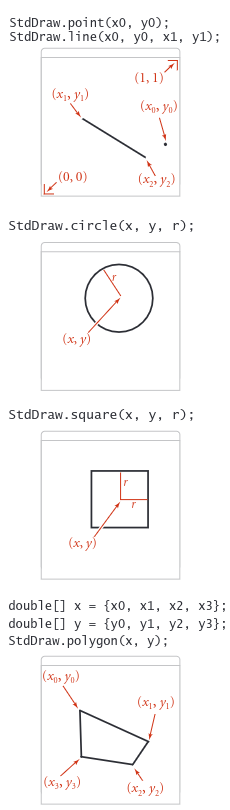

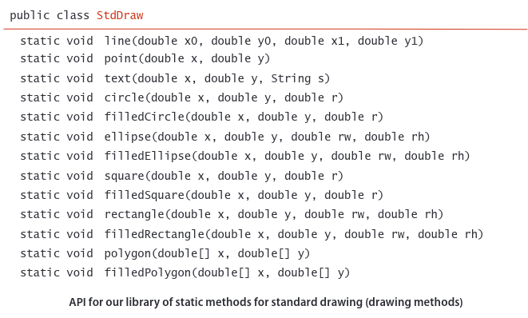

## Standard drawing (control methods). 
Pustaka ini juga menyertakan metode untuk mengubah skala dan ukuran kanvas, warna dan lebar garis, font teks, dan waktu menggambar (untuk digunakan dalam animasi). Sebagai argumen untuk setPenColor() Anda dapat menggunakan salah satu warna yang telah ditentukan sebelumnya BLACK, BLUE, CYAN, DARK_GRAY, GRAY, GREEN, LIGHT_GRAY, MAGENTA, ORANGE, PINK, RED, BOOK_RED, WHITE, dan YELLOW yang didefinisikan sebagai konstanta di StdDraw ( jadi kita merujuk salah satunya dengan kode seperti StdDraw.RED). Jendela ini juga menyertakan opsi menu untuk menyimpan gambar Anda ke file, dalam format yang sesuai untuk dipublikasikan di web.
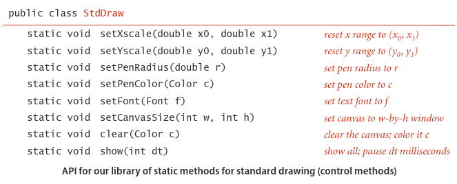
Dalam buku ini, kami menggunakan StdDraw untuk analisis data dan untuk membuat representasi visual dari algoritma yang sedang beroperasi. Tabel di halaman berikutnya menunjukkan beberapa kemungkinan; kita akan membahas lebih banyak contoh dalam teks dan latihan di seluruh buku ini. Perpustakaan juga mendukung animasi, tentu saja topik ini dibahas terutama
situs buku.

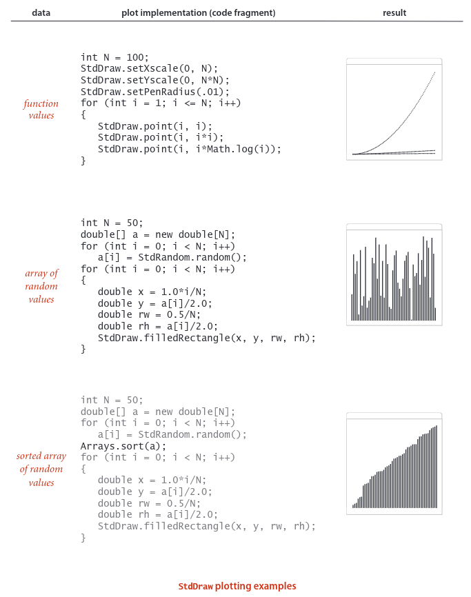