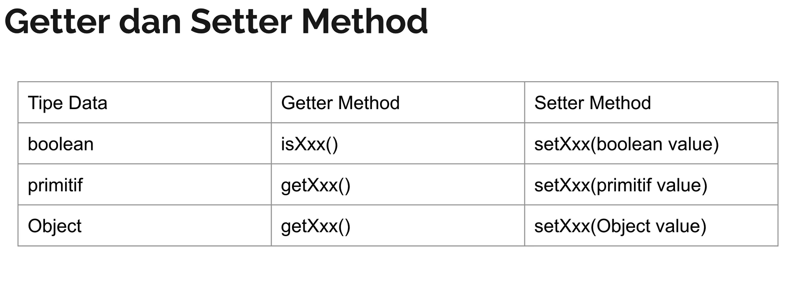

# Apa itu Object Oriented Programming?

- Object Oriented Programming adalah sudut pandang bahasa pemrograman yang berkonsep "Objek"
- Ada banyak sudut pandang bahasa pemrograman, namun OOP adalah yang sangat populer saat ini.
- Ada beberapa istilah yang perlu dimengerti dalam OOP, yaitu: Object dan Class

# Apa itu Object?

- Object adalah data yang berisi field / properties / attribute dan method / function / behavior
- Semua data bukan primitif di Java adalah Object, dari mulai Integer, Boolean, Character, String dan yang lainnya.

# Apa itu Class?

- Class adalah blue print, prototype atau cetakan untuk membuat object
- Class berisikan deklarasi semua properties dan functions yang dimiliki oleh Object
- Setiap Object selalu dibuat dari Class
- Dan sebuah Class bisa membuat Object tanpa batas

# Object Class

- Di Java, setiap class yang kita buat secara automatis adalah turunan dari class Object
- Walaupun tidak secara langsung kita menyebutkan extends Object, tapi secara automatis Java akan membuat class kita
  extends Object
- Bisa dikatakan class Object adalah super class untuk semua class yang ada di Java

# Polymorphism

- Polymorphism berasal dari bahasa Yunani yang berarti banyak bentuk.
- Dalam OOP, Polymorphism adalah kemampuan sebuah object berubah bentuk menjadi bentuk lain.
- Polymorphism erat sekali berhubungan dengan Inheritance

# Type Check & Casts

- Sebelumnya kita sudah tau cara melakukan konversi tipe data(casts) di tipe data primitif
- Cast juga bisa digunakan untuk tipe data bukan primitif
- Namun agar aman, sebelum melakukan cast, pastikan kita melakukan type check (pengecekan tipe data), dengan menggunakan
  kata kunci instanceof
- Hasil operator instanceof adalah boolean, true jika tipe data sesuai, false jika tidak sesuai

# Variable Hiding

- Variable hiding merupakan masalah yang terjadi ketika kita membuat nama properties sama di class child dengan nama
  properties di class parent
- Tidak ada yang namanya properties overriding, ketika kita buat ulang nama properties di class, class itu berarti
  variable hiding
- Untuk mengatasi variable hiding, caranya kita bisa menggunakan super keyword.
- yang membedakan variable hiding dan method overriding adalah ketika sebuah object di cast
- Saat object di cast, method akan tetap mengakses method overriding, namun variable akan mengakses variable yang ada di
  class nya

# Access Modifier

- Access modifier adalah kemampuan membuat class, properties, method dan constructor dapat diakses dari mana saja
- public, private, protected, defualt
- 

# Public Class

- Saat kita membuat public class, kita hanya bisa membuat 1 public class di 1 file .java
- Selain itu nama public class harus sama dengan nama file .java

# Abstract Class

- saat kita membuat class, kita bisa menjadikan sebuah class sebagai abstract class.
- Abstract class artinya, class yang tidak bisa dibuat sebagai object secara langsung, hanya bisa diturunkan
- Untuk membuat sebuah class menjadi abstract, kita bisa menggunakan kata kunci abstract sebelum kata kunci class
- Dengan demikian abstract class bisa kita gunakan sebagai kontrak untuk class child

# Abstract Method

- Saat kita membuat class yang abstract, kita bisa membuat abstract method juga di dalam class abstract tersebut
- Saat kita membuat sebuah abstract method, kita tidak boleh membuat block method untuk method tersebut
- Artinya, abstract method wajib di override di class child
- Abstract method tidak boleh memiliki access modifier private

# Getter dan Setter

- Encapsulation artinya memastikan data sensitif sebuah object tersembunyi dari kelas luar
- hal ini bertujuan agar kita bisa menjaga data sebuah object tetap baik dan valid
- Untuk mencapai ini, biasanya kita akan membuat semua properties menggunakan access modifier private, sehingga tidak
  bisa diakses atau diubah dari luar
- Agar bisa diubah, kita akan menyediakan method untuk mengubah dan mendapatkan properties tersebut
- Di Java, proses encapsulation sudah dibuat hukumnya, dimana kita bisa menggunakan Getter dan Setter method
- Getter adalah method yang dibuat untuk mengambil data properties
- Setter adalah method yang dibuat untuk mengubah data properties
- 

# Interface

- Sebelumnya kita sudah tahu bahwa abstract class itu bisa kita gunakan untuk kontrak class childnya atau inheritance
  yang dimana wajib mengoveride method yang ada pada parentnya
- Namun sebenarnya yang lebih tepat untuk kontrak adalah interface
- Interface mirip seperti abstract class, yang membedakan interface semua method otomatis abstract tidak memiliki block
- Di interface kita tidak boleh memiliki properties, kita hanya boleh memiliki constant(properties yang tidak bisa
  diubah)
- untuk mewariskan interface, kita tidak menggunakan kata kunci extends, melainkan kata kunci implements

# Interface Inheritance

- Sebelumnya kita sudah tahu kalau di Java. child class hanya bisa punya 1 class parent
- Namun berbeda dengan interface, sebuah child class bisa implement lebih dari 1 interface
- Bahkan interface pun bisa implement interface lain, bisa lebih dari 1. Namun jika interface ingin mewariskan interface
  lain. Kita menggunakan kata kunci extends, bukan implement
- jadi kalau dari class ke interface kata kuncinya implement
- kalau dari interface ke interface kata kuncunya extends

# Default Method

- Sebelumnya kita tahu bahwa di interface, kita tidak bisa membuat method konkrit yang memiliki block method
- Namun sejak Java Versi 8, ada fitur default method di interface
- Fitur ini terjadi karena sulit untuk maintain kontrak interface jika sudah terlalu banyak class yang implementasi interface tersebut
- Ketika kita menambahkan satu method di interface, secara otomatis semua class yang implement akan rusak karena harus meng-override method tersebut
- Dengan menggunakan default method, kita bisa menambahkan konkrit method di interface.

# ToString Method
- toString() adalah method yang terdapat di class Object
- Method ini biasanya digunakan untuk merepresentasikan object dalam bentuk String
- Secara default, toString() ini akan menghasilkan:
- namaClass + @ + hashCode
- Namun kita bisa mengubahnya jika kita mau, agar object yang kita buat lebih mudah dibaca

# Equals Method
- hal yang agak membingungkan di Java adalah, cara membandingkan object
- Di bahasa pemrograman lain, untuk mengecek apakah sebuah object itu sama, biasanya menggunakan operator ==,
- di Java operator == hanya untuk mengecek data primitif
- Untuk non primitif pengecekan nya menggunakan method equals
- Dan secara defualt, method equals itu akan membandingkan dua buah object secara kesamaan posisi object di memory, artinya jika kita membuat 2 object yang isi field nya sama, tetap dianggap beda oleh method equals
- Oleh karena itu, ada baiknya kita meng-override method equals milik class Object tersebut

# HashCode Method
- Method hashCode adalah method representasi integer object kita, mirip toString yang merupakan representasi String, hashCode adalah representasi Intger
- HashCode sangat bermanfaat untuk membuat structur data unique seperti HashMap, Set dan lain-lain, karena cukup menggunakan hashCode method untuk mendapatkan identitas unique object kita
- Secara default hashCode akan mengembalikan nilai integer sesuai data di memory, namun kita bisa meng-override nya jika kita ingin

# Kontrak HashCode Method
- Tidak mudah meng-override method hashCode, karena ada kontraknya:
- Sebanyak apapun hashCode dipanggil, untuk object yang sama, harus menghasilkan data integer yang sama
- Jika ada 2 object yang sama dibandingkan menggunakan method equals, maka nilai hashCode nya juga harus sama
- Tidak wajib hashCode berbeda jika method equals menghasilkan false, karena memang keterbatasan jumlah integer sekitar 2 milyar

# Final Class
- Sebelumnya kita pernah menggunakan kata kunci final di Java
- Jika digunakan di variable atau properties, maka variable atau properties tersebut tidak bisa berubah lagi datanya
- Final pun bisa digunakan di class, dimana jika kita menggunakan kata kunci final sebelum kata kunci class, maka kita menandakan bahwa class tersebut tidak bisa diwariskan lagi
- Secara otomatis semua class child nya akan error

# Final Method
- kata kunci final juga bisa digunakan di method
- jika sebuah method kita tambahkan kata kunci final, maka artinya method tersebut tidak bisa di override lagi di class child nya
- ini sangat cocok jika kita ingin mengunci implementasi dari sebuah method agar tidak bisa diubah lagi oleh class child nya

# Inner Class
- Di Java, kita bisa membuat class di dalam class, atau disebut dengan Inner Class
- Salah satu kasus kita membuat inner class biasanya ketika kita butuh membuat beberapa class yang saling berhubungan, dimana sebuah class tidak bisa dibuat tanpa class lain
- Misal kita perlu membuat class Employee, dimana membutuhkan class Company, maka kita bisa membuat class Employee sebagai Inner clas Company
- Cara membuat inner class, cukup membuatnya di dalam blok class outer class nya

# Mengakses Outer Class
- Keuntungan saat kita membuat inner adalah, kemampuan untuk mengakses outer class nya 
- Inner class bisa membaca semua private member yang ada di outer class nya
- Untuk mengakses object outer class nya, kita bisa menggunakan nama class outer nya diikuti dengan kata kunci this, misal Company.this
- Dan untuk mengakses super class outer class nya, kita bisa menggunakan nama class outer nya diikuti dengan kata kunci super, misal Company.super

