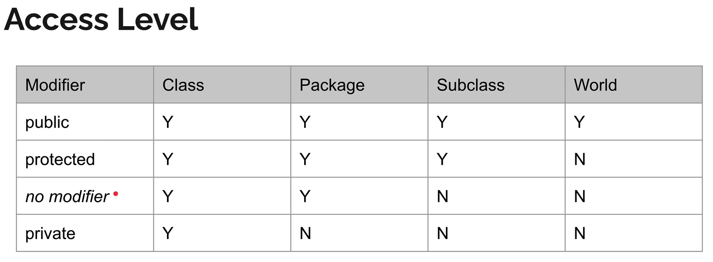

# Apa itu Object Oriented Programming?

- Object Oriented Programming adalah sudut pandang bahasa pemrograman yang berkonsep "Objek"
- Ada banyak sudut pandang bahasa pemrograman, namun OOP adalah yang sangat populer saat ini.
- Ada beberapa istilah yang perlu dimengerti dalam OOP, yaitu: Object dan Class

# Apa itu Object?

- Object adalah data yang berisi field / properties / attribute dan method / function / behavior
- Semua data bukan primitif di Java adalah Object, dari mulai Integer, Boolean, Character, String dan yang lainnya.

# Apa itu Class?

- Class adalah blue print, prototype atau cetakan untuk membuat object
- Class berisikan deklarasi semua properties dan functions yang dimiliki oleh Object
- Setiap Object selalu dibuat dari Class
- Dan sebuah Class bisa membuat Object tanpa batas

# Object Class

- Di Java, setiap class yang kita buat secara automatis adalah turunan dari class Object
- Walaupun tidak secara langsung kita menyebutkan extends Object, tapi secara automatis Java akan membuat class kita
  extends Object
- Bisa dikatakan class Object adalah super class untuk semua class yang ada di Java

# Polymorphism

- Polymorphism berasal dari bahasa Yunani yang berarti banyak bentuk.
- Dalam OOP, Polymorphism adalah kemampuan sebuah object berubah bentuk menjadi bentuk lain.
- Polymorphism erat sekali berhubungan dengan Inheritance

# Type Check & Casts
- Sebelumnya kita sudah tau cara melakukan konversi tipe data(casts) di tipe data primitif
- Cast juga bisa digunakan untuk tipe data bukan primitif
- Namun agar aman, sebelum melakukan cast, pastikan kita melakukan type check (pengecekan tipe data), dengan menggunakan kata kunci instanceof
- Hasil operator instanceof adalah boolean, true jika tipe data sesuai, false jika tidak sesuai

# Variable Hiding
- Variable hiding merupakan masalah yang terjadi ketika kita membuat nama properties sama di class child dengan nama properties di class parent
- Tidak ada yang namanya properties overriding, ketika kita buat ulang nama properties di class, class itu berarti variable hiding
- Untuk mengatasi variable hiding, caranya kita bisa menggunakan super keyword.
- yang membedakan variable hiding dan method overriding adalah ketika sebuah object di cast
- Saat object di cast, method akan tetap mengakses method overriding, namun variable akan mengakses variable yang ada di class nya

# Access Modifier
- Access modifier adalah kemampuan membuat class, properties, method dan constructor dapat diakses dari mana saja
- public, private, protected, defualt
- 

# Public Class
- Saat kita membuat public class, kita hanya bisa membuat 1 public class di 1 file .java
- Selain itu nama public class harus sama dengan nama file .java

# Abstract Class
- saat kita membuat class, kita bisa menjadikan sebuah class sebagai abstract class.
- Abstract class artinya, class yang tidak bisa dibuat sebagai object secara langsung, hanya bisa diturunkan
- Untuk membuat sebuah class menjadi abstract, kita bisa menggunakan kata kunci abstract sebelum kata kunci class
- Dengan demikian abstract class bisa kita gunakan sebagai kontrak untuk class child

# Abstract Method
- Saat kita membuat class yang abstract, kita bisa membuat abstract method juga di dalam class abstract tersebut
- Saat kita membuat sebuah abstract method, kita tidak boleh membuat block method untuk method tersebut
- Artinya, abstract method wajib di override di class child
- Abstract method tidak boleh memiliki access modifier private