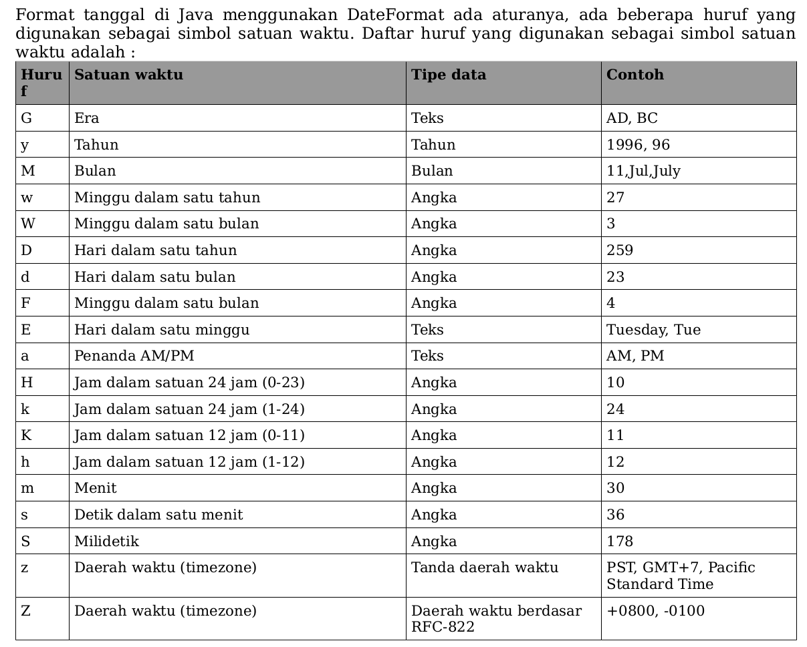
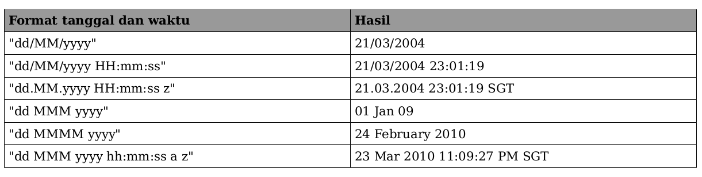

Date, Calendar, DateFormat

Bekerja dengan tanggal bukan pekerjaan yang mudah, terkadang kita perlu melakukan
perhitungan berdasarkan tanggal yang cukup rumit, misalnya mendapatkan hari terakhir dari
bulan tertentu atau mendapatkan selisih hari antara dua tanggal, atau bahkan bekerja dengan
calendar selain Masehi, misalnya penanggalan Budha. Java menyediakan class-class yang bisa
digunakan untuk tujuan tersebut, sehingga tidak perlu membuat kode untuk melakukan hal
tersebut secara manual.

Class Date adalah representasi dari waktu di Java, class ini terdapat dua jenis: java.util.Date
dan java.sql.Date. Class java.util.Date adalah class yang sering digunakan dalam perhitungan
tanggal, sedangkan java.sql.Date adalah representasi data tanggal di java yang setara dengan
tipe data date di dalam database. Kalau tidak bekerja dengan database, sebaiknya selalu
gunakan java.util.Date, sedangkan java.sql.Date hanya digunakan ketika kita bekerja dengan
database. Istilah class Date di dalam bab ini merujuk ke java.util.Date.

Class Date digunakan sebagai object untuk menyimpan waktu saja, hal ini terutama karena class
Date mengimplementasikan interface Serializable, plus semua fungsi untuk perhitungan sudah
ditandai deprecated.Sedangkan class Calendar digunakan layaknya kalkulator untuk proses
perhitungan tanggal pada class Date, misalnya kita ingin menambahkan 1 hari, menambah 1
menit dan seterusnya.

Calendar juga menyediakan sistem penanggalan Masehi
(GregorianCalendar), penanggalan Budha dengan bahas Thailand dan penanggalan Jepang.

DateFormat adalah class yang digunakan untuk memformat tanggal menjadi string. Class
turunan dari DateFormat yang sering digunakan adalah SimpleDateFormat. Class
SimpleDateFormat bisa digunakan untuk mengubah string menjadi tanggal dan sebaliknya dari
tanggal menjadi String. Class ini sebaiknya dibuat setiap kali akan digunakan, hal ini
dikarenakan class SimpleDateFormat tidak thread-safe, artinya kalau diinstansiasi sekali dan
digunakan dalam lingkungan multithreading maka hasilnya tidak konsisten.

